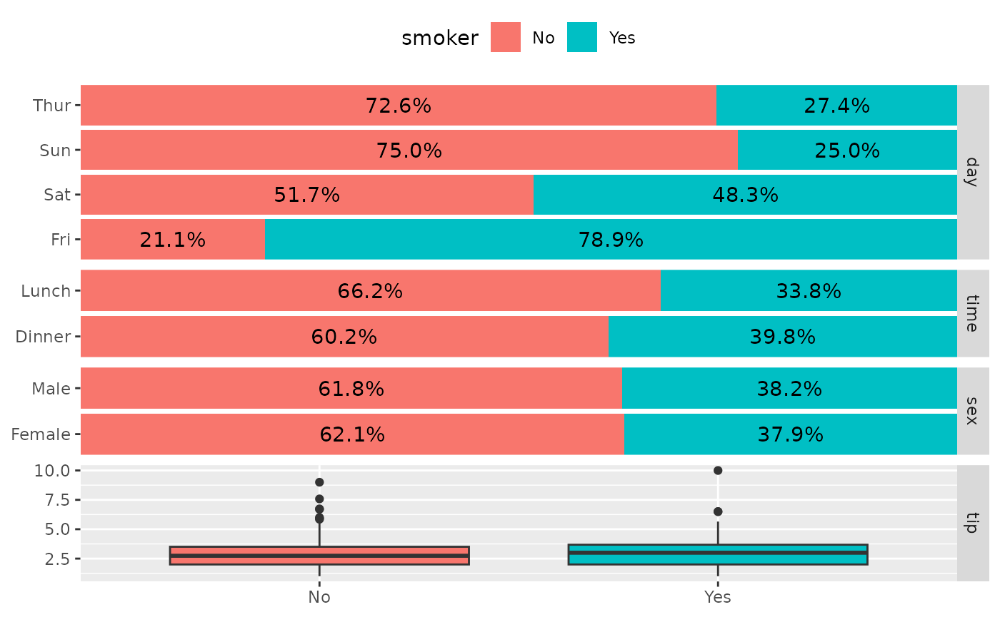
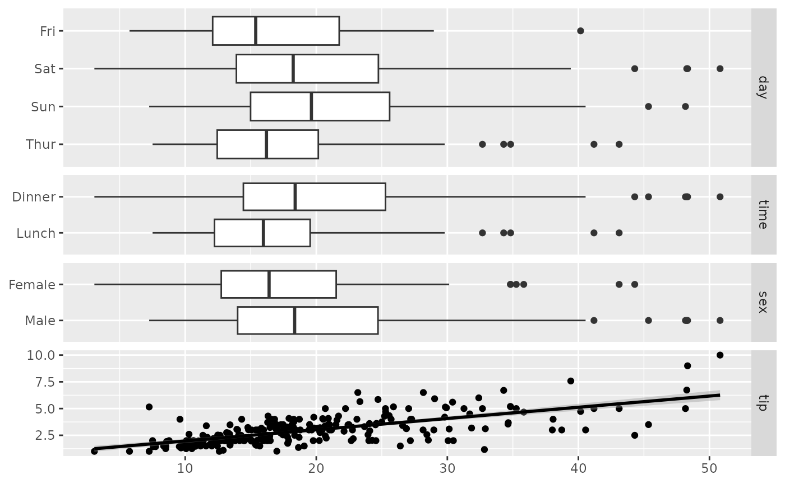
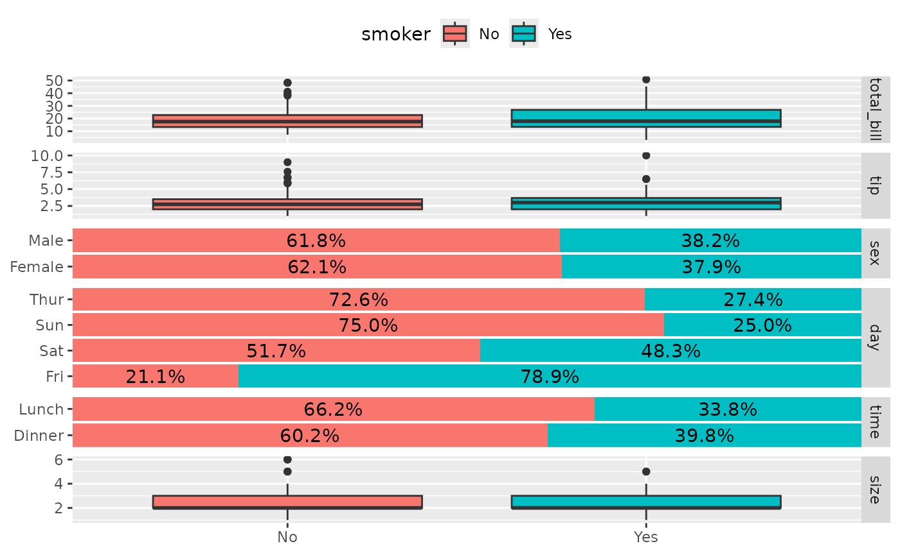
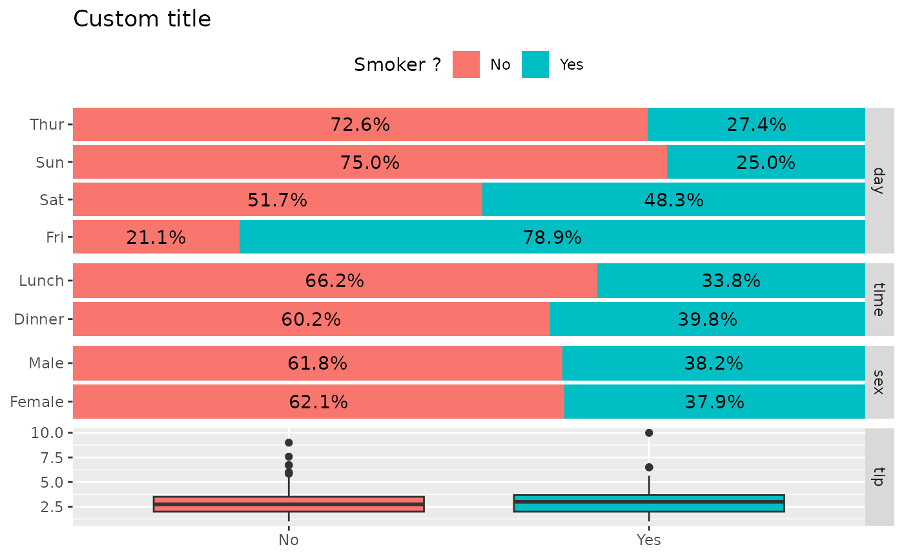
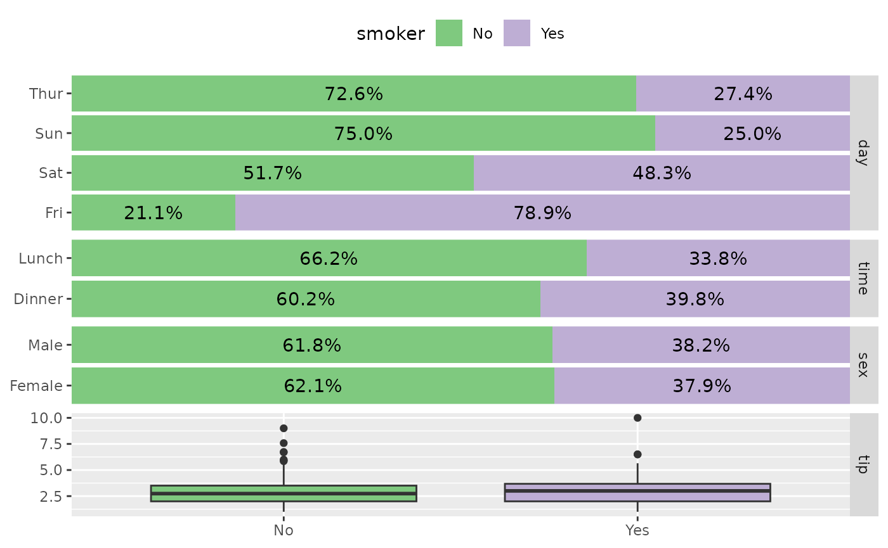
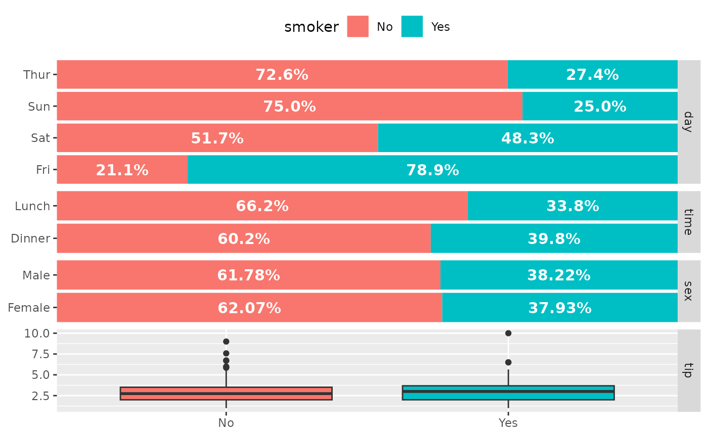
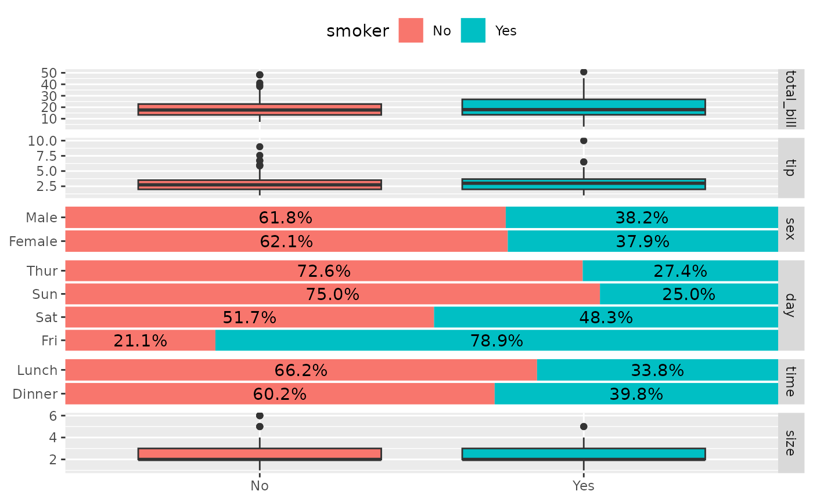
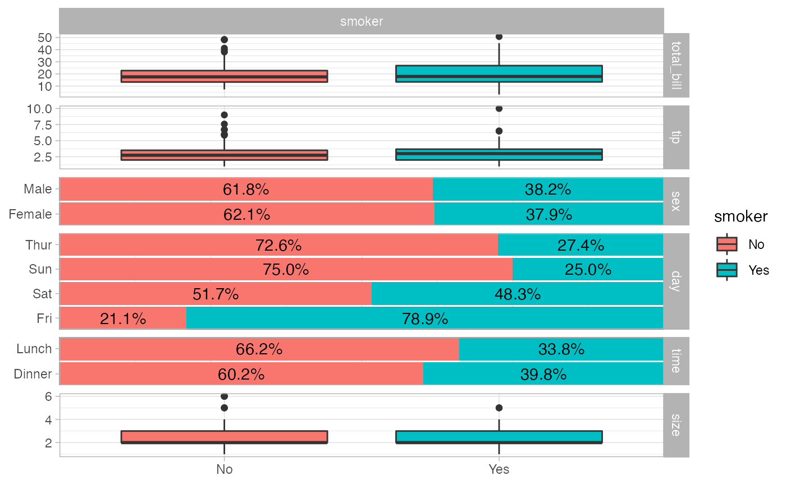
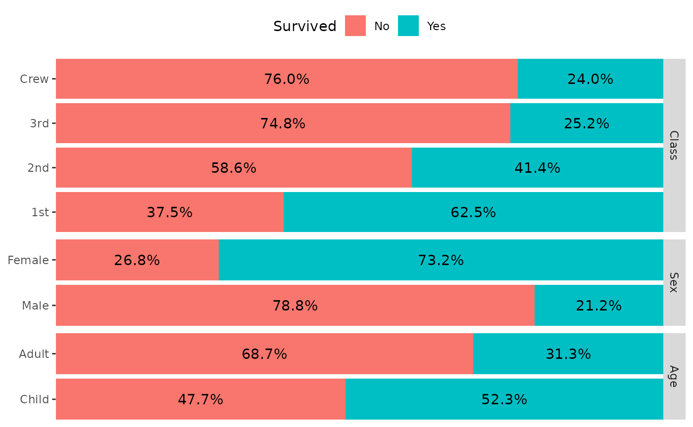
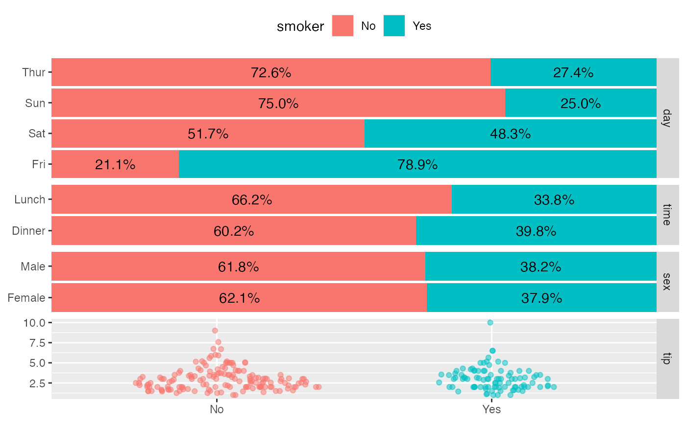

# ggbivariate(): Plot an outcome with several potential explanatory variables

``` r

library(GGally)
#> Loading required package: ggplot2
```

## `GGally::ggbivariate()`

The purpose of this function is to easily plot a visualization of the
bivariate relation between one outcome and several explanatory
variables.

### Basic example

Simply indicate the outcome and the explanatory variables. Both could be
discrete or continuous.

``` r

data(tips)
ggbivariate(tips, outcome = "smoker", explanatory = c("day", "time", "sex", "tip"))
```



``` r

ggbivariate(tips, outcome = "total_bill", explanatory = c("day", "time", "sex", "tip"))
```



If no explanatory variables are provided, will take all available
variables other than the outcome.

``` r

ggbivariate(tips, "smoker")
```



### Customize plot title and legend title

``` r

ggbivariate(
  tips, "smoker", c("day", "time", "sex", "tip"),
  title = "Custom title"
) +
  labs(fill = "Smoker ?")
#> Ignoring unknown labels:
#> • fill : "Smoker ?"
```



### Customize fill colour scale

``` r

ggbivariate(tips, "smoker", c("day", "time", "sex", "tip")) +
  scale_fill_brewer(type = "qual")
```



### Customize labels

``` r

ggbivariate(
  tips, "smoker", c("day", "time", "sex", "tip"),
  rowbar_args = list(
    colour = "white",
    size = 4,
    fontface = "bold",
    label_format = scales::label_percent(accurary = 1)
  )
)
```



### Choose the sub-plot from which to get the legend

``` r

ggbivariate(tips, "smoker")
```


``` r

ggbivariate(tips, "smoker", legend = 3)
```



### Change theme

``` r

ggbivariate(tips, "smoker") + theme_light()
```



### Use mapping to indicate weights

``` r

d <- as.data.frame(Titanic)
ggbivariate(d, "Survived", mapping = aes(weight = Freq))
```



### Use types to customize types of subplots

``` r

ggbivariate(
  tips,
  outcome = "smoker",
  explanatory = c("day", "time", "sex", "tip"),
  types = list(comboVertical = "autopoint")
)
```



For more customization options, you could directly use
[`ggduo()`](https://ggobi.github.io/ggally/dev/reference/ggduo.md) (see
also `vig_ggally("ggduo")`).
