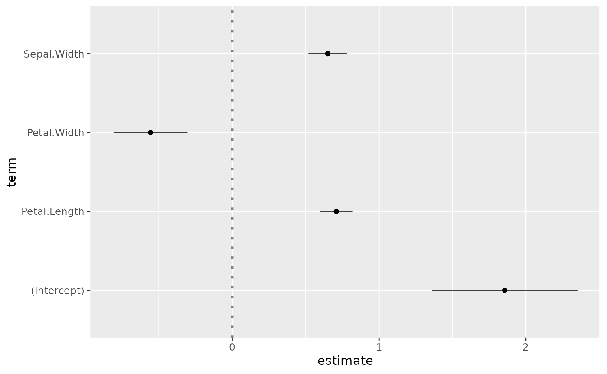
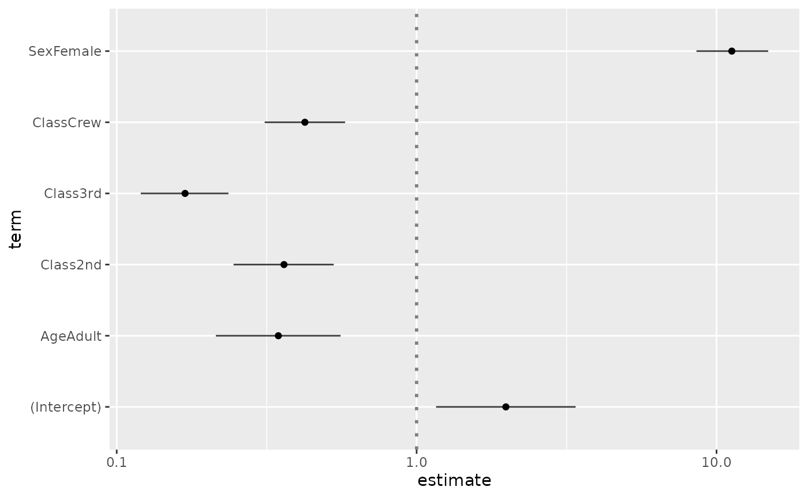
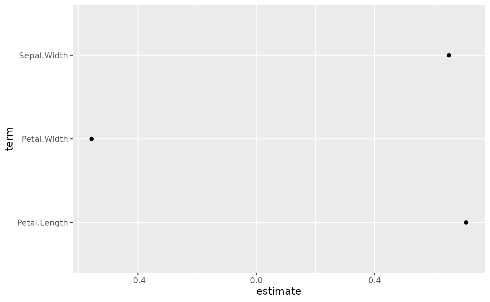
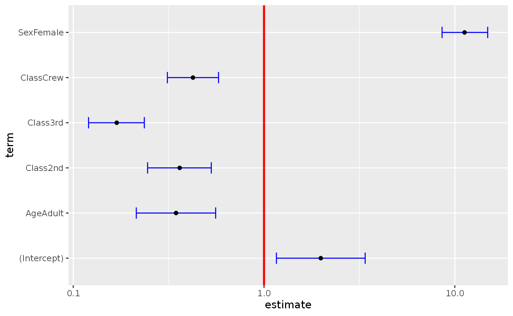
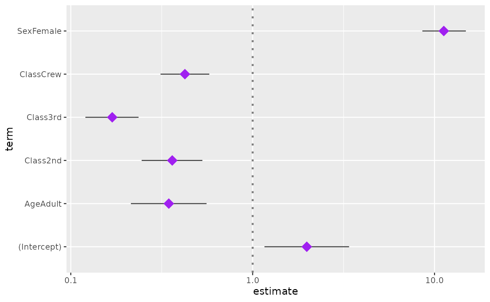
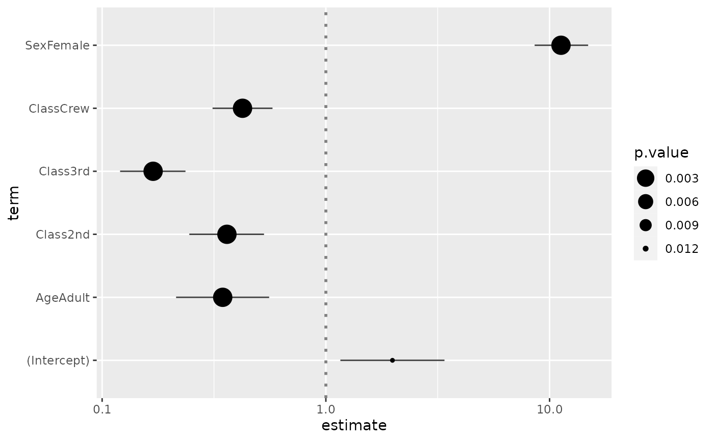
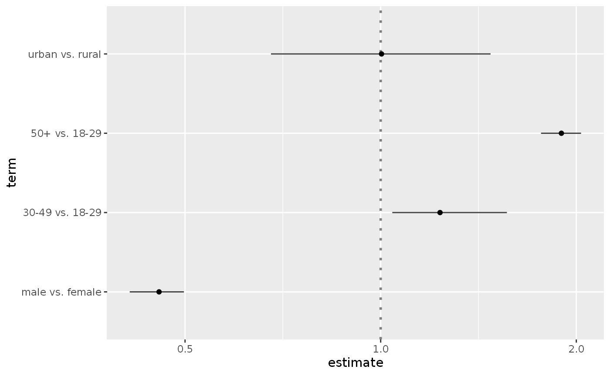
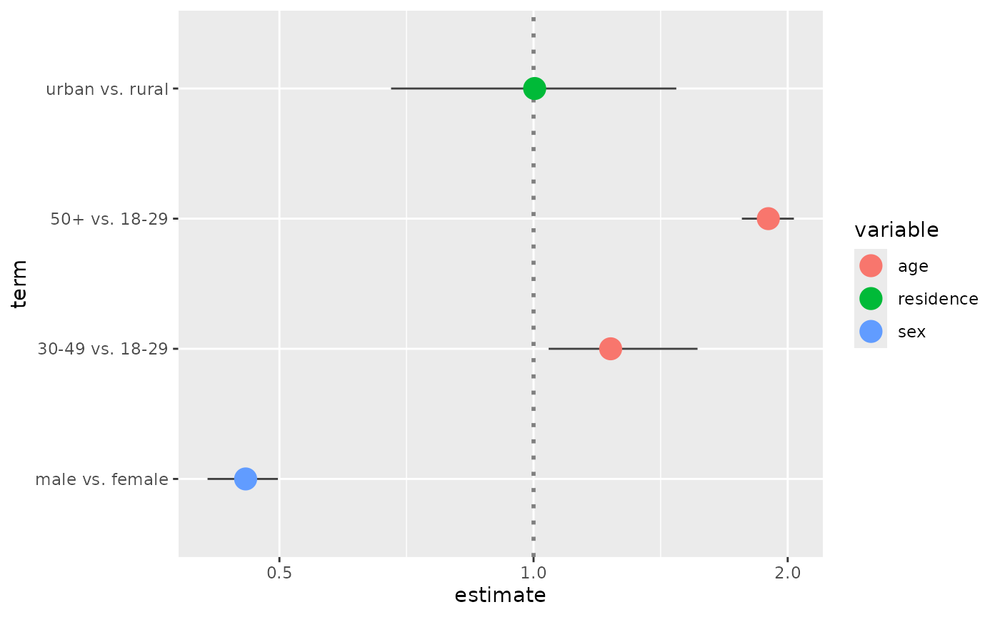

# ggcoef(): Model coefficients

``` r

library(GGally)
#> Loading required package: ggplot2
```

## `GGally::ggcoef()`

The purpose of this function is to quickly plot the coefficients of a
model. For an updated and improved version, see
[`GGally::ggcoef_model()`](https://larmarange.github.io/ggstats/reference/ggcoef_model.html)
and the [corresponding
vignette](https://ggobi.github.io/ggally/articles/ggcoef_model.html).

### Quick coefficients plot

To work automatically, this function requires the `broom` package.
Simply call
[`ggcoef()`](https://ggobi.github.io/ggally/dev/reference/ggcoef.md)
with a model object. It could be the result of
[`stats::lm`](https://rdrr.io/r/stats/lm.html),
[`stats::glm`](https://rdrr.io/r/stats/glm.html) or any other model
covered by `broom` and its
[`broom::tidy`](https://generics.r-lib.org/reference/tidy.html)
method[^1].

``` r

reg <- lm(Sepal.Length ~ Sepal.Width + Petal.Length + Petal.Width, data = iris)
ggcoef(reg)
```



In the case of a logistic regression (or any other model for which
coefficients are usually exponentiated), simply indicated
`exponentiate = TRUE`. Note that a logarithmic scale will be used for
the x-axis.

``` r

d <- as.data.frame(Titanic)
log.reg <- glm(Survived ~ Sex + Age + Class, family = binomial, data = d, weights = d$Freq)
ggcoef(log.reg, exponentiate = TRUE)
```



### Customizing the plot

You can use `conf.int`, `vline` and `exclude_intercept` to display or
not confidence intervals as error bars, a vertical line for `x = 0` (or
`x = 1` if coefficients are exponentiated) and the intercept.

``` r

ggcoef(reg, vline = FALSE, conf.int = FALSE, exclude_intercept = TRUE)
```



See the help page of
[`ggcoef()`](https://ggobi.github.io/ggally/dev/reference/ggcoef.md) for
the full list of arguments that could be used to personalize how error
bars and the vertical line are plotted.

``` r

ggcoef(
  log.reg,
  exponentiate = TRUE,
  vline_color = "red",
  vline_linetype = "solid",
  errorbar_color = "blue",
  errorbar_height = .25
)
```



Additional parameters will be passed to \[ggplot2::geom_point()\].

``` r

ggcoef(log.reg, exponentiate = TRUE, color = "purple", size = 5, shape = 18)
```



Finally, you can also customize the aesthetic mapping of the points.

``` r

library(ggplot2)
ggcoef(log.reg, exponentiate = TRUE, mapping = aes(x = estimate, y = term, size = p.value)) +
  scale_size_continuous(trans = "reverse")
#> Warning: Using `size` aesthetic for lines was deprecated in ggplot2 3.4.0.
#> ℹ Please use `linewidth` instead.
#> ℹ The deprecated feature was likely used in the GGally package.
#>   Please report the issue at <https://github.com/ggobi/ggally/issues>.
#> This warning is displayed once per session.
#> Call `lifecycle::last_lifecycle_warnings()` to see where this warning
#> was generated.
```



### Custom data frame

You can also pass a custom data frame to \[ggcoef()\]. The following
variables are expected:

- `term` (except if you customize the mapping)
- `estimate` (except if you customize the mapping)
- `conf.low` and `conf.high` (only if you want to display error bars)

``` r

cust <- data.frame(
  term = c("male vs. female", "30-49 vs. 18-29", "50+ vs. 18-29", "urban vs. rural"),
  estimate = c(.456, 1.234, 1.897, 1.003),
  conf.low = c(.411, 1.042, 1.765, 0.678),
  conf.high = c(.498, 1.564, 2.034, 1.476),
  variable = c("sex", "age", "age", "residence")
)
cust$term <- factor(cust$term, cust$term)
ggcoef(cust, exponentiate = TRUE)
```



``` r

ggcoef(
  cust,
  exponentiate = TRUE,
  mapping = aes(x = estimate, y = term, colour = variable),
  size = 5
)
```



[^1]: See <http://www.rdocumentation.org/packages/broom>.
