# ggduo(): Two-grouped plot matrix

``` r

library(GGally)
#> Loading required package: ggplot2
```

## `GGally::ggduo()`

The purpose of this function is to display two grouped data in a plot
matrix. This is useful for canonical correlation analysis, multiple time
series analysis, and regression analysis.

### Canonical Correlation Analysis

This example is derived from

`R Data Analysis Examples | Canonical Correlation Analysis. UCLA: Institute for Digital Research and Education. from http://www.stats.idre.ucla.edu/r/dae/canonical-correlation-analysis (accessed May 22, 2017).`

`Example 1. A researcher has collected data on three psychological variables, four academic variables (standardized test scores) and gender for 600 college freshman. She is interested in how the set of psychological variables relates to the academic variables and gender. In particular, the researcher is interested in how many dimensions (canonical variables) are necessary to understand the association between the two sets of variables."`

``` r

data(psychademic)
str(psychademic)
#> 'data.frame':    600 obs. of  8 variables:
#>  $ locus_of_control: num  -0.84 -0.38 0.89 0.71 -0.64 1.11 0.06 -0.91 0.45 0 ...
#>  $ self_concept    : num  -0.24 -0.47 0.59 0.28 0.03 0.9 0.03 -0.59 0.03 0.03 ...
#>  $ motivation      : chr  "4" "3" "3" "3" ...
#>  $ read            : num  54.8 62.7 60.6 62.7 41.6 62.7 41.6 44.2 62.7 62.7 ...
#>  $ write           : num  64.5 43.7 56.7 56.7 46.3 64.5 39.1 39.1 51.5 64.5 ...
#>  $ math            : num  44.5 44.7 70.5 54.7 38.4 61.4 56.3 46.3 54.4 38.3 ...
#>  $ science         : num  52.6 52.6 58 58 36.3 58 45 36.3 49.8 55.8 ...
#>  $ sex             : chr  "female" "female" "male" "male" ...
#>  - attr(*, "academic")= chr [1:5] "read" "write" "math" "science" ...
#>  - attr(*, "psychology")= chr [1:3] "locus_of_control" "self_concept" "motivation"
(psych_variables <- attr(psychademic, "psychology"))
#> [1] "locus_of_control" "self_concept"     "motivation"
(academic_variables <- attr(psychademic, "academic"))
#> [1] "read"    "write"   "math"    "science" "sex"
```

First, look at the within correlation using
[`ggpairs()`](https://ggobi.github.io/ggally/dev/reference/ggpairs.md).

``` r

ggpairs(psychademic, psych_variables, title = "Within Psychological Variables")
#> `stat_bin()` using `bins = 30`. Pick better value `binwidth`.
#> `stat_bin()` using `bins = 30`. Pick better value `binwidth`.
```

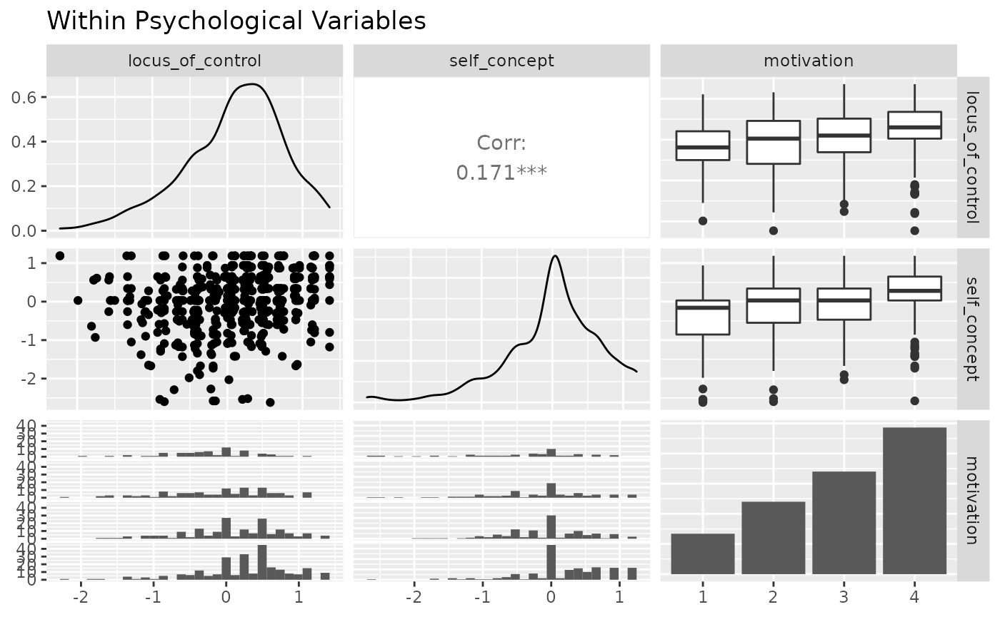

``` r

ggpairs(psychademic, academic_variables, title = "Within Academic Variables")
#> `stat_bin()` using `bins = 30`. Pick better value `binwidth`.
#> `stat_bin()` using `bins = 30`. Pick better value `binwidth`.
#> `stat_bin()` using `bins = 30`. Pick better value `binwidth`.
#> `stat_bin()` using `bins = 30`. Pick better value `binwidth`.
```

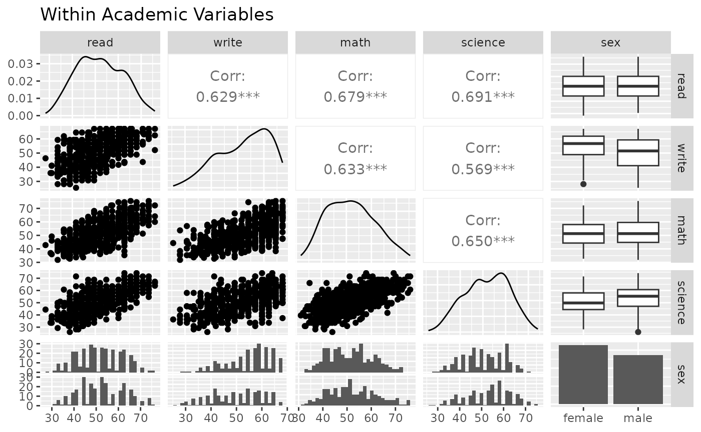

Next, look at the between correlation using
[`ggduo()`](https://ggobi.github.io/ggally/dev/reference/ggduo.md).

``` r

ggduo(
  psychademic, psych_variables, academic_variables,
  types = list(continuous = "smooth_lm"),
  title = "Between Academic and Psychological Variable Correlation",
  xlab = "Psychological",
  ylab = "Academic"
)
#> `stat_bin()` using `bins = 30`. Pick better value `binwidth`.
#> `stat_bin()` using `bins = 30`. Pick better value `binwidth`.
```

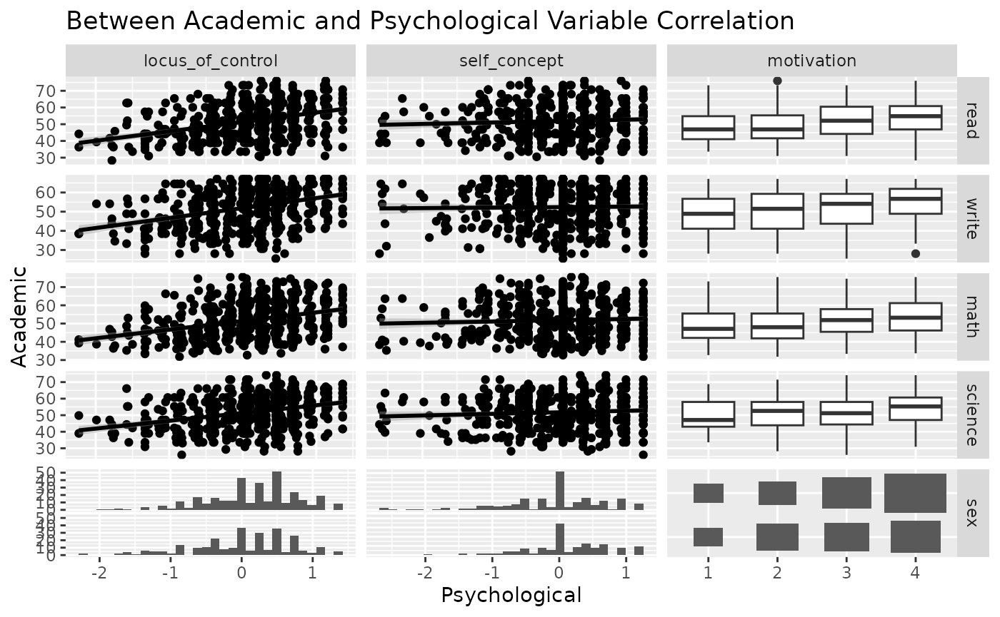

Since ggduo does not have a upper section to display the correlation
values, we may use a custom function to add the information in the
continuous plots. The strips may be removed as each group name may be
recovered in the outer axis labels.

``` r

lm_with_cor <- function(data, mapping, ..., method = "pearson") {
  x <- eval_data_col(data, mapping$x)
  y <- eval_data_col(data, mapping$y)
  cor <- cor(x, y, method = method)
  ggally_smooth_lm(data, mapping, ...) +
    ggplot2::geom_label(
      data = data.frame(
        x = min(x, na.rm = TRUE),
        y = max(y, na.rm = TRUE),
        lab = round(cor, digits = 3)
      ),
      mapping = ggplot2::aes(x = x, y = y, label = lab),
      hjust = 0, vjust = 1,
      size = 5, fontface = "bold",
      inherit.aes = FALSE # do not inherit anything from the ...
    )
}
ggduo(
  psychademic, rev(psych_variables), academic_variables,
  mapping = aes(color = sex),
  types = list(continuous = wrap(lm_with_cor, alpha = 0.25)),
  showStrips = FALSE,
  title = "Between Academic and Psychological Variable Correlation",
  xlab = "Psychological",
  ylab = "Academic",
  legend = c(5, 2)
) +
  theme(legend.position = "bottom")
#> `stat_bin()` using `bins = 30`. Pick better value `binwidth`.
#> `stat_bin()` using `bins = 30`. Pick better value `binwidth`.
#> `stat_bin()` using `bins = 30`. Pick better value `binwidth`.
```

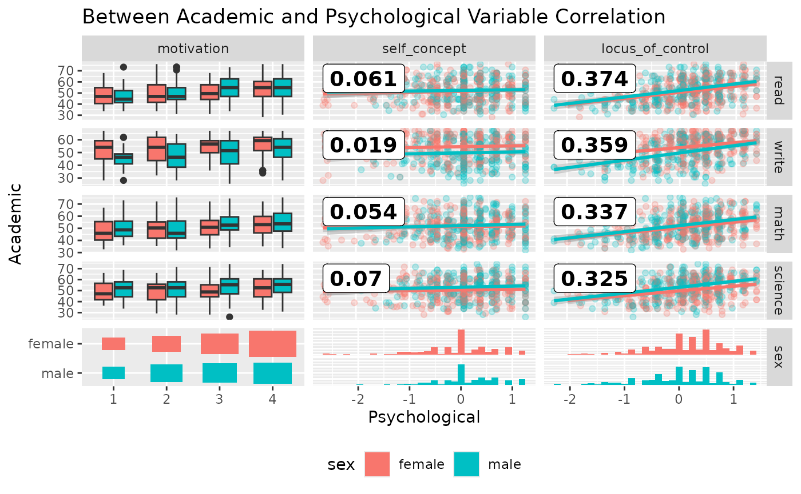

### Multiple Time Series Analysis

While displaying multiple time series vertically over time, such as
`+ ggplot2::facet_grid(time ~ .)`,
[`ggduo()`](https://ggobi.github.io/ggally/dev/reference/ggduo.md) can
handle both continuous and discrete data. `ggplot2` does not mix
discrete and continuous data on the same axis.

``` r

library(ggplot2)

data(pigs)
pigs_dt <- pigs[-(2:3)] # remove year and quarter
pigs_dt$profit_group <- as.numeric(pigs_dt$profit > mean(pigs_dt$profit))
ggplot(
  tidyr::pivot_longer(pigs_dt, -time),
  aes(x = time, y = value)
) +
  geom_smooth() +
  geom_point() +
  facet_grid(name ~ ., scales = "free_y")
#> `geom_smooth()` using method = 'loess' and formula = 'y ~ x'
```

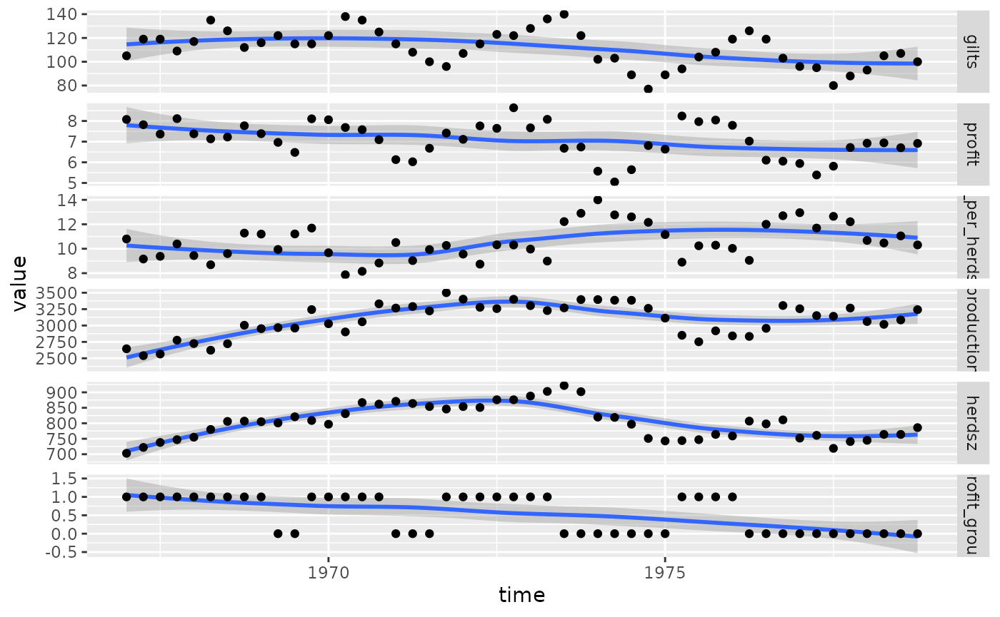

Instead, we may use `ggts` to display the data. `ggts` changes the
default behavior of ggduo of `columnLabelsX` to equal `NULL` and allows
for mixed variable types.

``` r

# make the profit group as a factor value
profit_groups <- c(
  "1" = "high",
  "0" = "low"
)
pigs_dt$profit_group <- factor(
  profit_groups[as.character(pigs_dt$profit_group)],
  levels = unname(profit_groups),
  ordered = TRUE
)
ggts(pigs_dt, "time", 2:7)
#> `stat_bin()` using `bins = 30`. Pick better value `binwidth`.
```

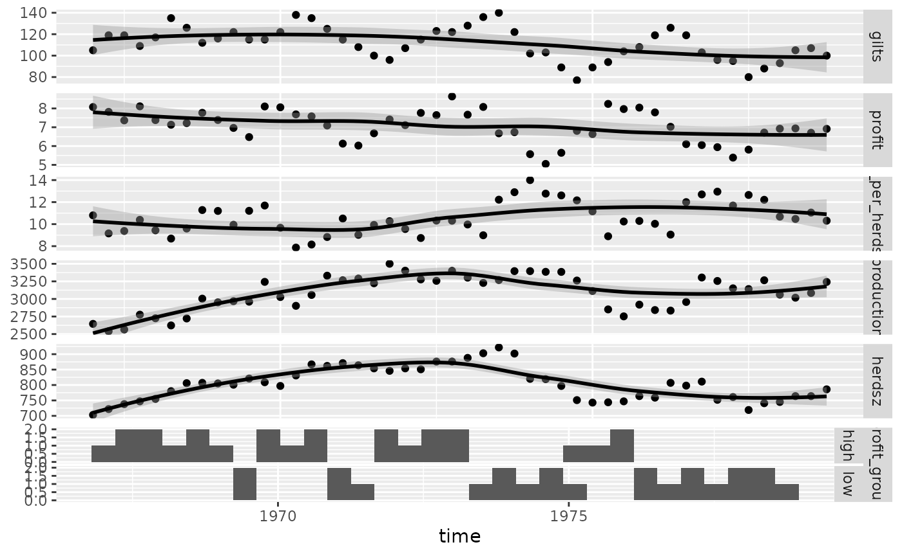

``` r

# remove the binwidth warning
pigs_types <- list(
  comboHorizontal = wrap(ggally_facethist, binwidth = 1)
)
ggts(pigs_dt, "time", 2:7, types = pigs_types)
```

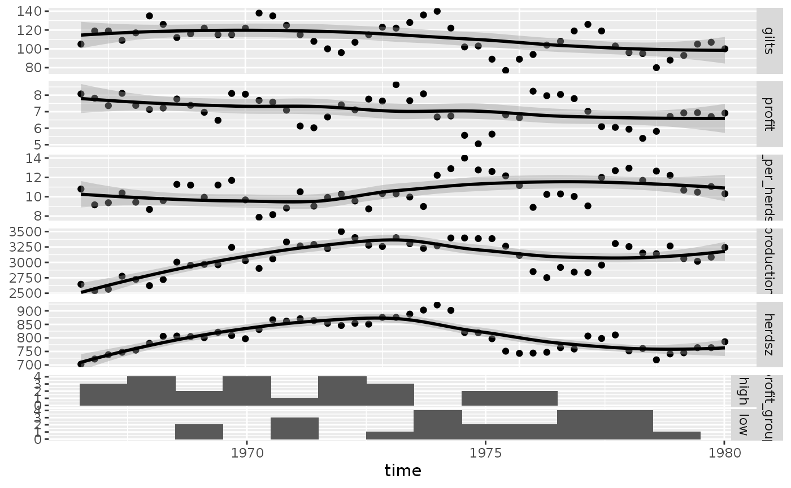

``` r

# add color and legend
pigs_mapping <- aes(color = profit_group)
ggts(pigs_dt, pigs_mapping, "time", 2:7, types = pigs_types, legend = c(6, 1))
```

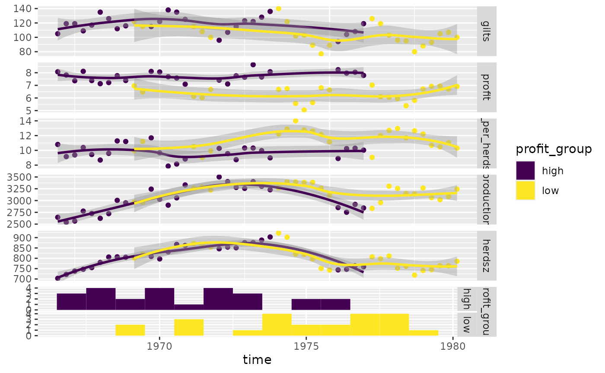

Produce more meaningful labels, add a legend, and remove profit group
strips.

``` r

pm <- ggts(
  pigs_dt, pigs_mapping,
  1, 2:7,
  types = pigs_types,
  legend = c(6, 1),
  columnLabelsY = c(
    "number of\nfirst birth sows",
    "sell price over\nfeed cost",
    "sell count over\nheard size",
    "meat head count",
    "breading\nheard size",
    "profit\ngroup"
  ),
  showStrips = FALSE
) +
  labs(fill = "profit group") +
  theme(
    legend.position = "bottom",
    strip.background = element_rect(
      fill = "transparent", color = "grey80"
    )
  )
pm
#> Ignoring unknown labels:
#> • fill : "profit group"
#> Ignoring unknown labels:
#> • fill : "profit group"
#> Ignoring unknown labels:
#> • fill : "profit group"
#> Ignoring unknown labels:
#> • fill : "profit group"
#> Ignoring unknown labels:
#> • fill : "profit group"
#> Ignoring unknown labels:
#> • fill : "profit group"
```

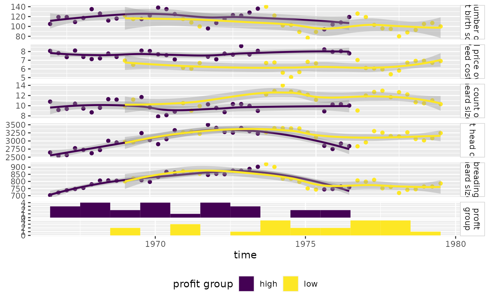

### Regression Analysis

Since [`ggduo()`](https://ggobi.github.io/ggally/dev/reference/ggduo.md)
may take custom functions just like
[`ggpairs()`](https://ggobi.github.io/ggally/dev/reference/ggpairs.md),
we will make a custom function that displays the residuals with a red
line at 0 and all other y variables will receive a simple linear
regression plot.

Note: the marginal residuals are calculated before plotting and the
y_range is found to display all residuals on the same scale.

``` r

swiss <- datasets::swiss

# add a 'fake' column
swiss$Residual <- seq_len(nrow(swiss))

# calculate all residuals prior to display
residuals <- lapply(swiss[2:6], function(x) {
  summary(lm(Fertility ~ x, data = swiss))$residuals
})
# calculate a consistent y range for all residuals
y_range <- range(unlist(residuals))

# custom function to display continuous data. If the y variable is "Residual", do custom work.
lm_or_resid <- function(data, mapping, ..., line_color = "red", line_size = 1) {
  if (!identical(
    rlang::expr_text(mapping$y),
    rlang::expr_text(ggplot2::aes(y = Residual)$y)
  )) {
    return(ggally_smooth_lm(data, mapping, ...))
  }

  # make residual data to display
  resid_data <- data.frame(
    x = rlang::eval_tidy(mapping$x, data = data),
    y = rlang::eval_tidy(mapping$x, data = residuals)
  )

  ggplot(data = data, mapping = mapping) +
    geom_hline(yintercept = 0, color = line_color, linewidth = line_size) +
    ylim(y_range) +
    geom_point(data = resid_data, mapping = aes(x = x, y = y), ...)
}

# plot the data
ggduo(
  swiss,
  2:6, c(1, 7),
  types = list(continuous = lm_or_resid)
)
```

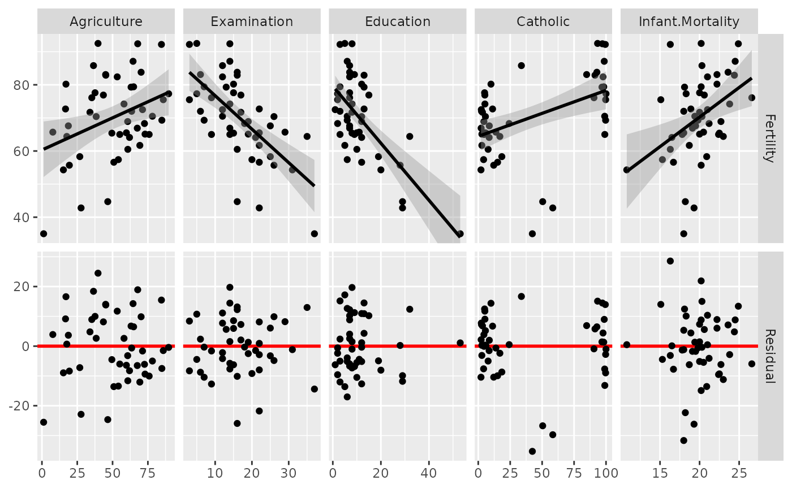

``` r


# change line to be thicker and blue and the points to be slightly transparent
ggduo(
  swiss,
  2:6, c(1, 7),
  types = list(
    continuous = wrap(lm_or_resid,
      alpha = 0.7,
      line_color = "blue",
      line_size = 3
    )
  )
)
```

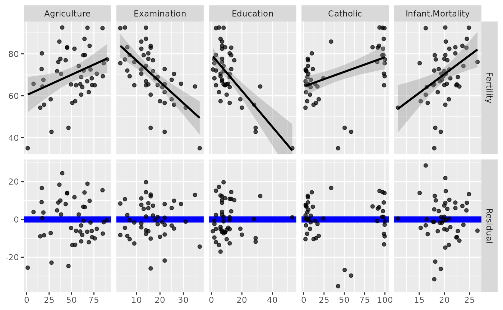

### Types of plots

You can customize the type of plots to display with the `types`
argument. `types` is a list that may contain the variables ‘continuous’,
‘combo’, ‘discrete’, and ‘na’. Each element of the list may be a
function or a string. If a string is supplied, it must be a character
string representing the tail end of a `ggally_NAME` function.

- `continuous`: when both x and y variables are continuous
- `comboHorizontal`: when x is continuous and y is discrete
- `comboVorizontal`: when x is discrete and y is continuous
- `discrete`: when both x and y variables are discrete
- `na`: when all x data and all y data is `NA`

The list of current valid `ggally_NAME` functions is visible in
`vig_ggally("ggally_plots")`.
