# ggmatrix(): Plot matrix

``` r

library(GGally)
#> Loading required package: ggplot2
```

## `GGally::ggmatrix()`

[`ggmatrix()`](https://ggobi.github.io/ggally/dev/reference/ggmatrix.md)
is a function for managing multiple plots in a matrix-like layout. It
was designed to adapt to any number of columns and rows. This allows for
very customized plot matrices.

### Generic Example

The examples below use plots labeled 1 to 6 to distinguish where the
plots are being placed.

``` r

plotList <- list()
for (i in 1:6) {
  plotList[[i]] <- ggally_text(paste("Plot #", i, sep = ""))
}

# bare minimum of plotList, nrow, and ncol
pm <- ggmatrix(plotList, 2, 3)
pm
```

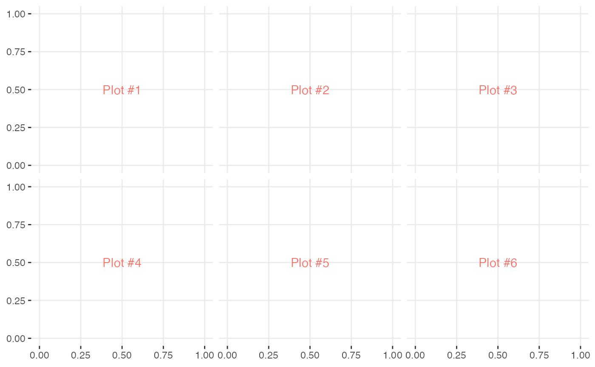

``` r


# provide more information
pm <- ggmatrix(
  plotList,
  nrow = 2, ncol = 3,
  xAxisLabels = c("A", "B", "C"),
  yAxisLabels = c("D", "E"),
  title = "Matrix Title"
)
pm
```


``` r


# display plots in column order
pm <- ggmatrix(
  plotList,
  nrow = 2, ncol = 3,
  xAxisLabels = c("A", "B", "C"),
  yAxisLabels = c("D", "E"),
  title = "Matrix Title",
  byrow = FALSE
)
pm
```

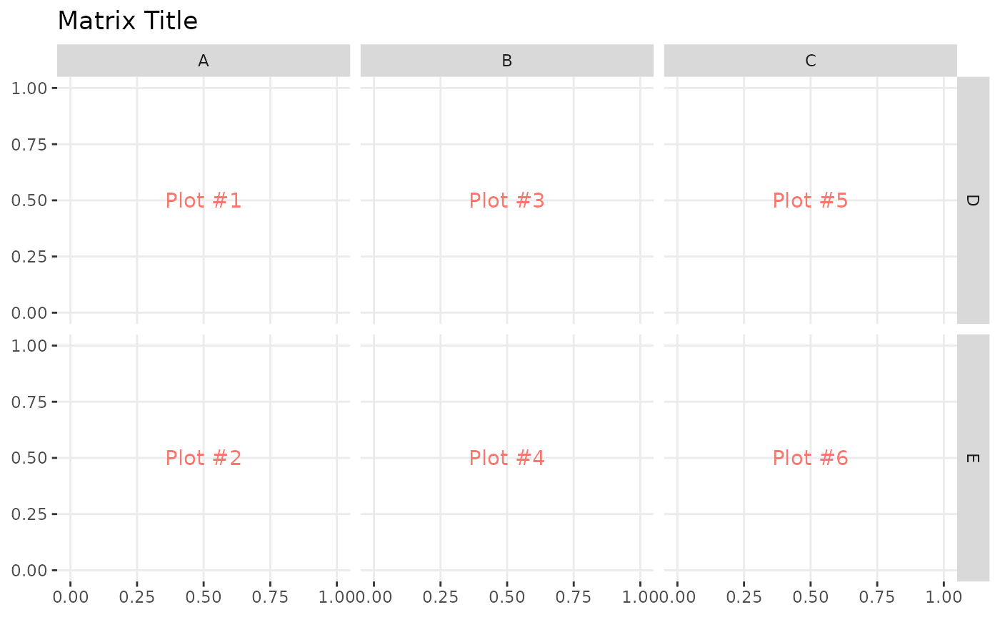

### Matrix Subsetting

Individual plots may be retrieved from the plot matrix and can be placed
in the plot matrix.

``` r

pm <- ggmatrix(
  plotList,
  nrow = 2, ncol = 3,
  xAxisLabels = c("A", "B", "C"),
  yAxisLabels = c("D", "E"),
  title = "Matrix Title"
)
pm
```


``` r

p2 <- pm[1, 2]
p3 <- pm[1, 3]
p2
```

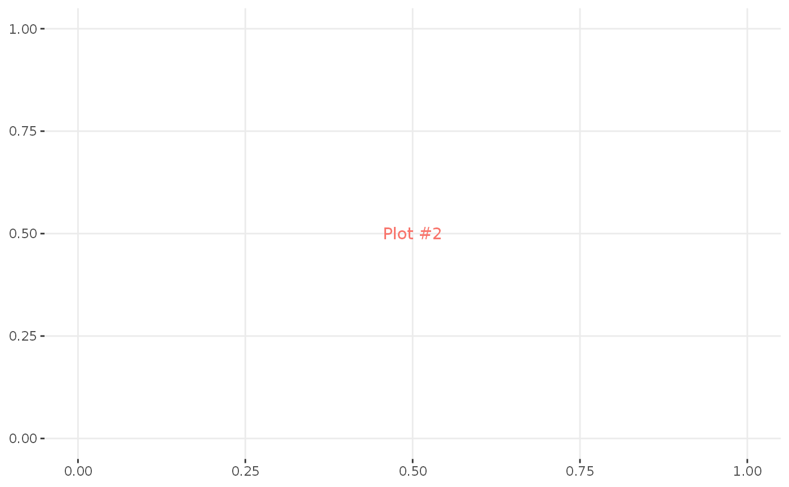

``` r

p3
```

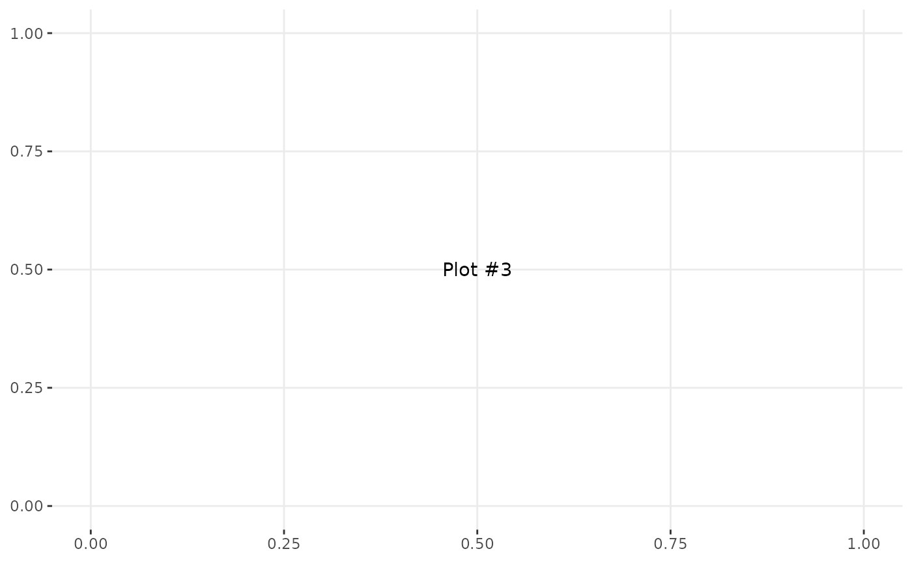

``` r

pm[1, 2] <- p3
pm[1, 3] <- p2
pm
```

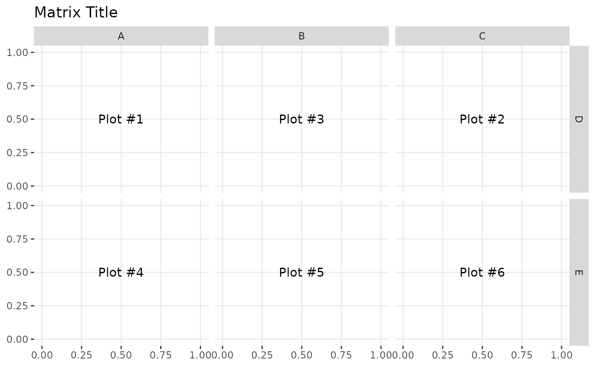

### Themes

``` r

library(ggplot2)
pm <- ggmatrix(
  plotList,
  nrow = 2, ncol = 3,
  xAxisLabels = c("A", "B", "C"),
  yAxisLabels = c("D", "E"),
  title = "Matrix Title",
  byrow = FALSE
)
pm <- pm + theme_bw()
pm
```

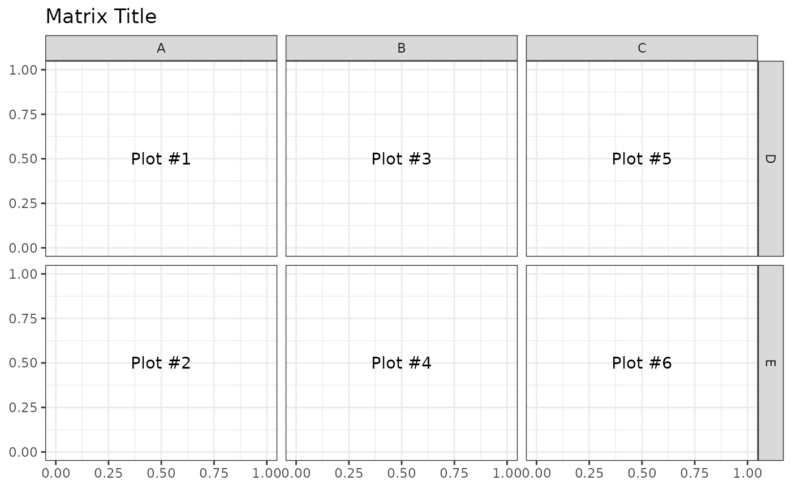

### Axis Control

The X and Y axis have booleans to turn on/off the individual plot’s axes
on the bottom and left sides of the plot matrix. To save time,
`showAxisPlotLabels` can be set to override `showXAxisPlotLabels` and
`showYAxisPlotLabels`.

``` r

pm <- ggmatrix(
  plotList,
  nrow = 2, ncol = 3,
  xAxisLabels = c("A", "B", "C"),
  yAxisLabels = c("D", "E"),
  title = "No Left Plot Axis",
  showYAxisPlotLabels = FALSE
)
pm
```

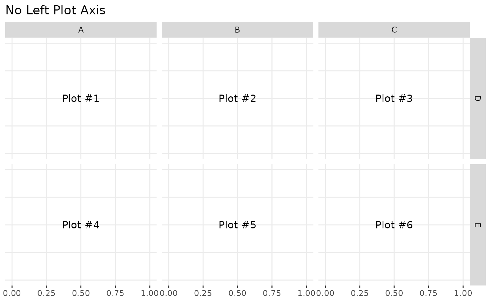

``` r

pm <- ggmatrix(
  plotList,
  nrow = 2, ncol = 3,
  xAxisLabels = c("A", "B", "C"),
  yAxisLabels = c("D", "E"),
  title = "No Bottom Plot Axis",
  showXAxisPlotLabels = FALSE
)
pm
```

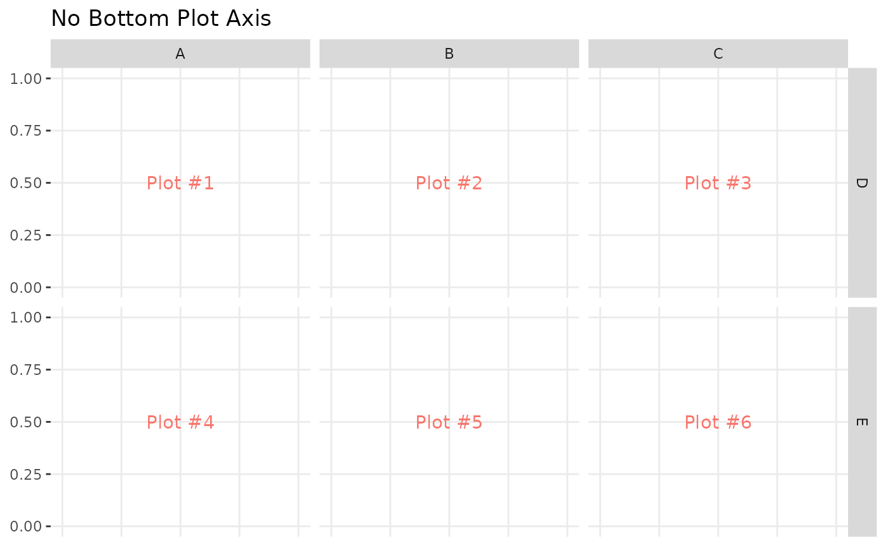

``` r

pm <- ggmatrix(
  plotList,
  nrow = 2, ncol = 3,
  xAxisLabels = c("A", "B", "C"),
  yAxisLabels = c("D", "E"),
  title = "No Plot Axes",
  showAxisPlotLabels = FALSE
)
pm
```

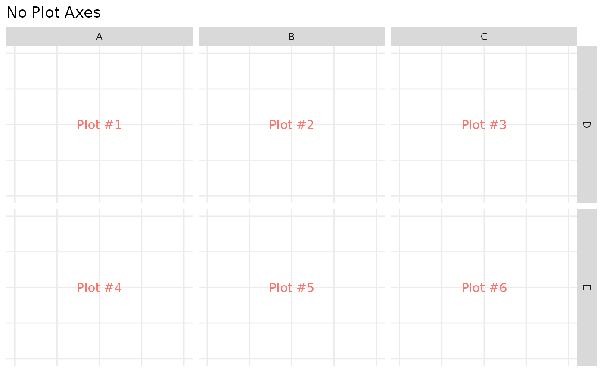

### Strips Control

By default, the plots in the top row and the right most column will
display top-side and right-side strips respectively
(`showStrips = NULL`). If all strips need to appear in each plot,
`showStrips` may be set to `TRUE`. If all strips should not be
displayed, `showStrips` may be set to `FALSE`.

``` r

data(tips)
subPlot <- function(smoker_value, sex_value) {
  ggplot(
    data = tips[tips$smoker == smoker_value & tips$sex == sex_value, ],
    aes(x = !!as.name("total_bill"), y = !!as.name("tip"))
  ) +
    geom_point() +
    facet_grid(time ~ day)
}
plotList <- list(
  subPlot("No", "Female"),
  subPlot("Yes", "Female"),
  subPlot("No", "Male"),
  subPlot("Yes", "Male")
)

pm <- ggmatrix(
  plotList,
  nrow = 2, ncol = 2,
  yAxisLabels = c("Female", "Male"),
  xAxisLabels = c("Non Smoker", "Smoker"),
  title = "Total Bill vs Tip",
  showStrips = NULL # default
)
pm
```

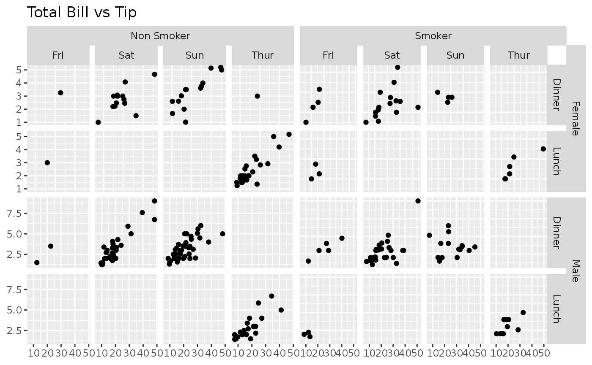

``` r

pm <- ggmatrix(
  plotList,
  nrow = 2, ncol = 2,
  yAxisLabels = c("Female", "Male"),
  xAxisLabels = c("Non Smoker", "Smoker"),
  title = "Total Bill vs Tip",
  showStrips = TRUE
)
pm
```

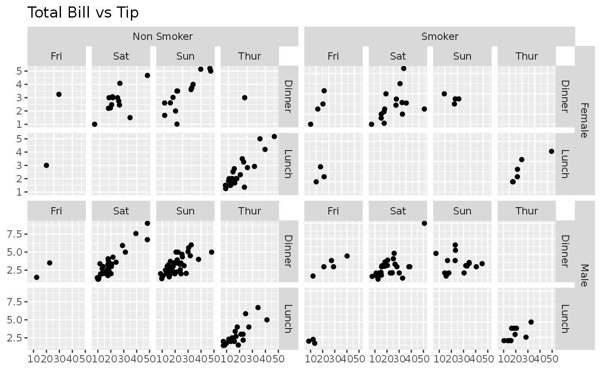

``` r

pm <- ggmatrix(
  plotList,
  nrow = 2, ncol = 2,
  yAxisLabels = c("Female", "Male"),
  xAxisLabels = c("Non Smoker", "Smoker"),
  title = "Total Bill vs Tip",
  showStrips = FALSE
)
pm
```

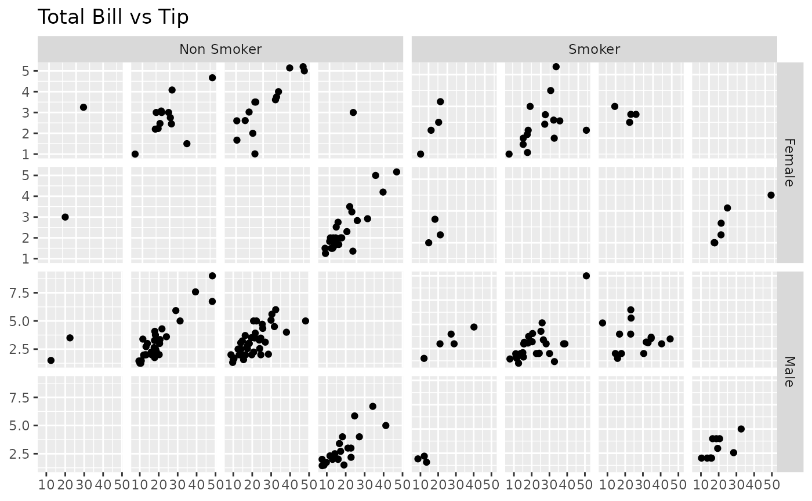
