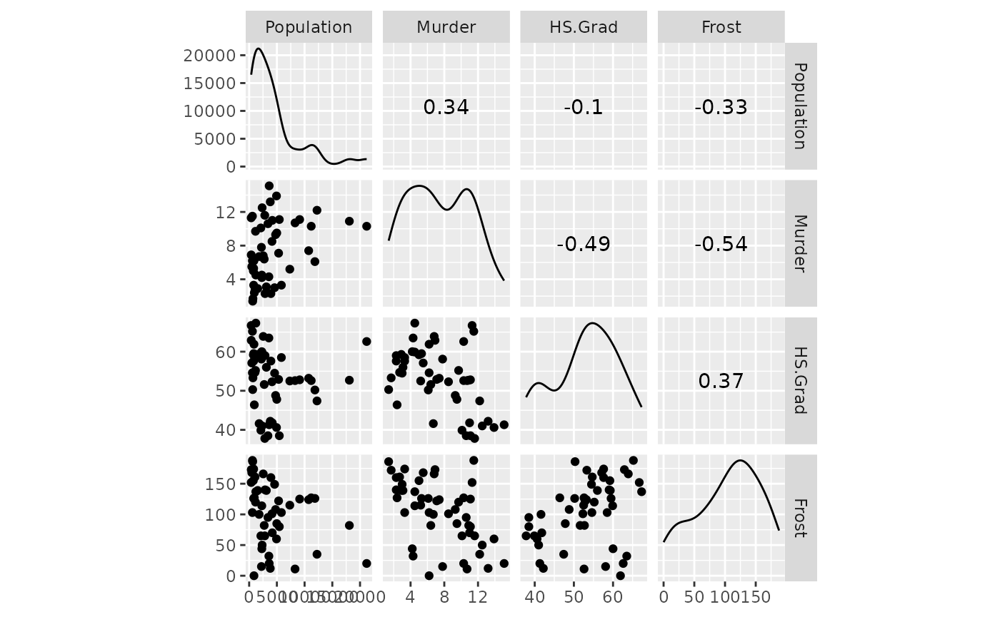
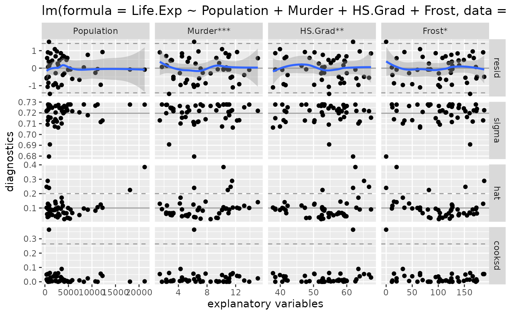
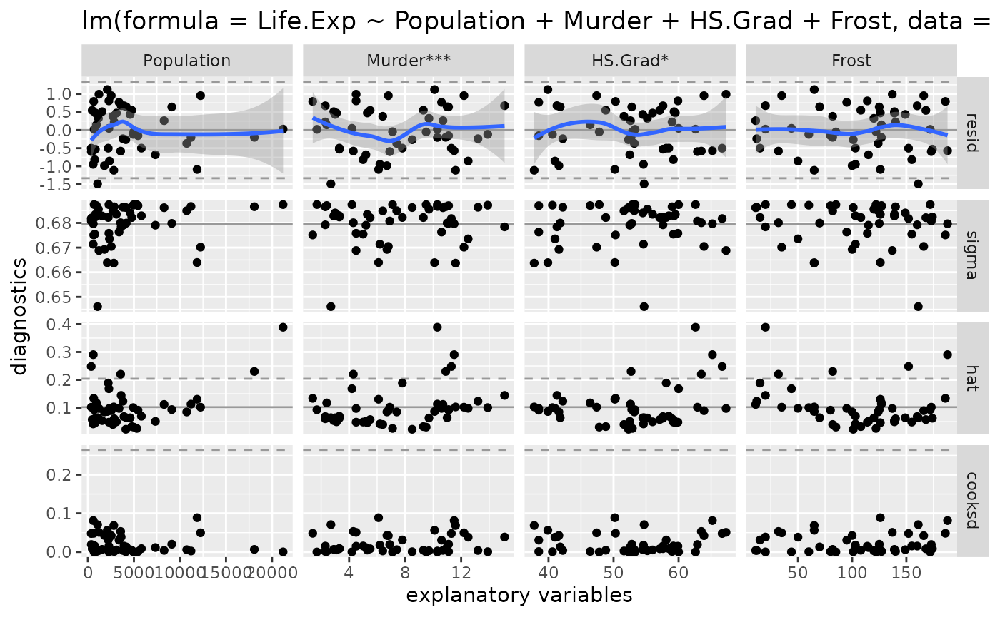
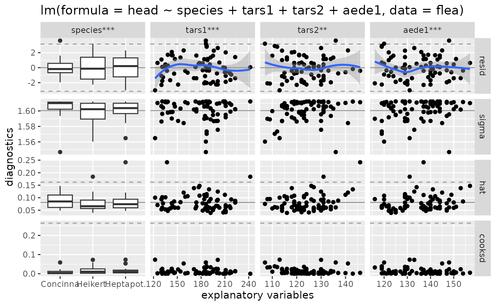
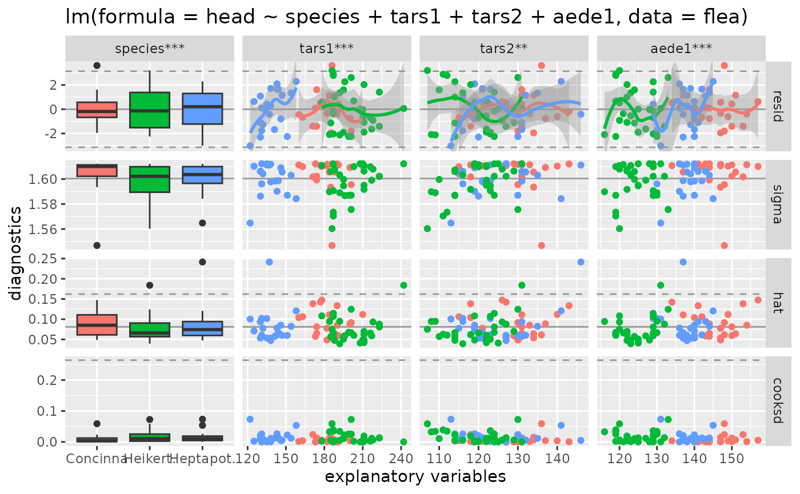
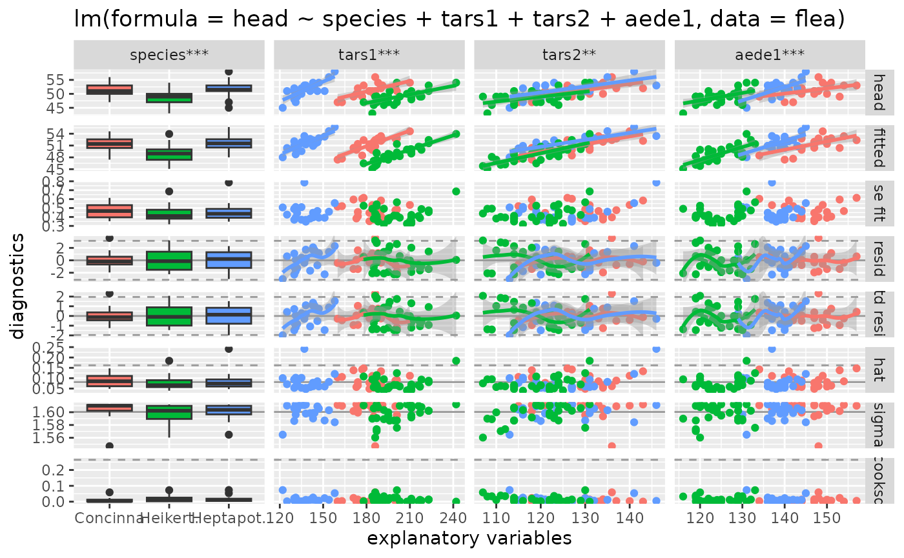

# ggnostic(): Model diagnostics

``` r

library(GGally)
#> Loading required package: ggplot2
```

## `GGally::ggnostic()`

[`ggnostic()`](https://ggobi.github.io/ggally/dev/reference/ggnostic.md)
is a display wrapper to
[`ggduo()`](https://ggobi.github.io/ggally/dev/reference/ggduo.md) that
displays full model diagnostics for each given explanatory variable. By
default,
[`ggduo()`](https://ggobi.github.io/ggally/dev/reference/ggduo.md)
displays the residuals, leave-one-out model sigma value, leverage
points, and Cook’s distance against each explanatory variable. The rows
of the plot matrix can be expanded to include fitted values, standard
error of the fitted values, standardized residuals, and any of the
response variables. If the model is a linear model, stars are added
according to the [`stats::anova`](https://rdrr.io/r/stats/anova.html)
significance of each explanatory variable.

Most diagnostic plots contain reference line(s) to help determine if the
model is fitting properly

- **residuals:**
  - Type key: `".resid"`
  - A solid line is located at the expected value of 0 with dashed lines
    at the 95% confidence interval. ($`0 \pm 1.96 * \sigma`$)
  - Plot function:
    [`ggally_nostic_resid()`](https://ggobi.github.io/ggally/dev/reference/ggally_nostic_resid.md).
  - See also
    [`stats::residuals`](https://rdrr.io/r/stats/residuals.html)
- **standardized residuals:**
  - Type key: `".std.resid"`
  - Same as residuals, except the standardized residuals equal the
    regular residuals divided by sigma. The dashed lines are located at
    $`0 \pm 1.96 * 1`$.
  - Plot function:
    [`ggally_nostic_std_resid()`](https://ggobi.github.io/ggally/dev/reference/ggally_nostic_std_resid.md).
  - See also
    [`stats::rstandard`](https://rdrr.io/r/stats/influence.measures.html)
- **leave-one-out model sigma:**
  - Type key: `".sigma"`
  - A solid line is located at the full model’s sigma value.
  - Plot function:
    [`ggally_nostic_sigma()`](https://ggobi.github.io/ggally/dev/reference/ggally_nostic_sigma.md).
  - See also
    [`stats::influence`](https://rdrr.io/r/stats/lm.influence.html)’s
    value on `sigma`
- **leverage points:**
  - Type key: `".hat"`
  - The expected value for the diagonal of a hat matrix is $`p / n`$.
    Points are considered leverage points if they are large than
    $`2 * p / n`$, where the higher line is drawn.
  - Plot function:
    [`ggally_nostic_hat()`](https://ggobi.github.io/ggally/dev/reference/ggally_nostic_hat.md).
  - See also
    [`stats::influence`](https://rdrr.io/r/stats/lm.influence.html)’s
    value on `hat`
- **Cook’s distance:**
  - Type key: `".cooksd"`
  - Points that are larger than $`4 / n`$ line are considered highly
    influential points. Plot function:
    [`ggally_nostic_cooksd()`](https://ggobi.github.io/ggally/dev/reference/ggally_nostic_cooksd.md).
    See also
    [`stats::cooks.distance()`](https://rdrr.io/r/stats/influence.measures.html)
- **fitted points:**
  - Type key: `".fitted"`
  - No reference lines by default.
  - Default plot function:
    [`ggally_points()`](https://ggobi.github.io/ggally/dev/reference/ggally_points.md).
  - See also [`stats::predict`](https://rdrr.io/r/stats/predict.html)
- **standard error of fitted points**:
  - Type key: `".se.fit"`
  - No reference lines by default.
  - Plot function:
    [`ggally_nostic_se_fit()`](https://ggobi.github.io/ggally/dev/reference/ggally_nostic_se_fit.md).
  - See also
    [`stats::fitted`](https://rdrr.io/r/stats/fitted.values.html)
- **response variables:**
  - Type key: (response name in data.frame)
  - No reference lines by default.
  - Default plot function:
    [`ggally_points()`](https://ggobi.github.io/ggally/dev/reference/ggally_points.md).

### Life Expectancy Model Fitting

Looking at the dataset
[`datasets::state.x77`](https://rdrr.io/r/datasets/state.html), we will
fit a multiple regression model for Life Expectancy.

``` r

# make a data.frame and fix column names
state <- as.data.frame(state.x77)
colnames(state)[c(4, 6)] <- c("Life.Exp", "HS.Grad")
str(state)
#> 'data.frame':    50 obs. of  8 variables:
#>  $ Population: num  3615 365 2212 2110 21198 ...
#>  $ Income    : num  3624 6315 4530 3378 5114 ...
#>  $ Illiteracy: num  2.1 1.5 1.8 1.9 1.1 0.7 1.1 0.9 1.3 2 ...
#>  $ Life.Exp  : num  69 69.3 70.5 70.7 71.7 ...
#>  $ Murder    : num  15.1 11.3 7.8 10.1 10.3 6.8 3.1 6.2 10.7 13.9 ...
#>  $ HS.Grad   : num  41.3 66.7 58.1 39.9 62.6 63.9 56 54.6 52.6 40.6 ...
#>  $ Frost     : num  20 152 15 65 20 166 139 103 11 60 ...
#>  $ Area      : num  50708 566432 113417 51945 156361 ...

# fit full model
model <- lm(Life.Exp ~ ., data = state)
# reduce to "best fit" model with
model <- step(model, trace = FALSE)
summary(model)
#> 
#> Call:
#> lm(formula = Life.Exp ~ Population + Murder + HS.Grad + Frost, 
#>     data = state)
#> 
#> Residuals:
#>      Min       1Q   Median       3Q      Max 
#> -1.47095 -0.53464 -0.03701  0.57621  1.50683 
#> 
#> Coefficients:
#>               Estimate Std. Error t value Pr(>|t|)    
#> (Intercept)  7.103e+01  9.529e-01  74.542  < 2e-16 ***
#> Population   5.014e-05  2.512e-05   1.996  0.05201 .  
#> Murder      -3.001e-01  3.661e-02  -8.199 1.77e-10 ***
#> HS.Grad      4.658e-02  1.483e-02   3.142  0.00297 ** 
#> Frost       -5.943e-03  2.421e-03  -2.455  0.01802 *  
#> ---
#> Signif. codes:  0 '***' 0.001 '**' 0.01 '*' 0.05 '.' 0.1 ' ' 1
#> 
#> Residual standard error: 0.7197 on 45 degrees of freedom
#> Multiple R-squared:  0.736,  Adjusted R-squared:  0.7126 
#> F-statistic: 31.37 on 4 and 45 DF,  p-value: 1.696e-12
```

Next, we look at the variables for any high (\|value\| \> 0.8)
correlation values and general interaction behavior.

``` r

# look at variables for high correlation (none)
ggscatmat(state, columns = c("Population", "Murder", "HS.Grad", "Frost"))
```



All variables appear to be ok. Next, we look at the model diagnostics.

``` r

# look at model diagnostics
ggnostic(model)
#> `geom_smooth()` using method = 'loess'
#> `geom_smooth()` using method = 'loess'
#> `geom_smooth()` using method = 'loess'
#> `geom_smooth()` using method = 'loess'
```



- The residuals appear to be normally distributed. There are a couple
  residual outliers, but 2.5 outliers are expected.
- There are 5 leverage points according the diagonal of the hat matrix
- There are 2 leverage points according to Cook’s distance. One is
  **much** larger than the other.

Let’s remove the largest data point first to try and define a better
model.

``` r

# very high life expectancy
state[11, ]
#>        Population Income Illiteracy Life.Exp Murder HS.Grad Frost Area
#> Hawaii        868   4963        1.9     73.6    6.2    61.9     0 6425
state_no_hawaii <- state[-11, ]
model_no_hawaii <- lm(Life.Exp ~ Population + Murder + HS.Grad + Frost, data = state_no_hawaii)
ggnostic(model_no_hawaii)
#> `geom_smooth()` using method = 'loess'
#> `geom_smooth()` using method = 'loess'
#> `geom_smooth()` using method = 'loess'
#> `geom_smooth()` using method = 'loess'
```



There are no more outrageous Cook’s distance values. The model without
Hawaii appears to be a good fitting model.

``` r

summary(model)
#> 
#> Call:
#> lm(formula = Life.Exp ~ Population + Murder + HS.Grad + Frost, 
#>     data = state)
#> 
#> Residuals:
#>      Min       1Q   Median       3Q      Max 
#> -1.47095 -0.53464 -0.03701  0.57621  1.50683 
#> 
#> Coefficients:
#>               Estimate Std. Error t value Pr(>|t|)    
#> (Intercept)  7.103e+01  9.529e-01  74.542  < 2e-16 ***
#> Population   5.014e-05  2.512e-05   1.996  0.05201 .  
#> Murder      -3.001e-01  3.661e-02  -8.199 1.77e-10 ***
#> HS.Grad      4.658e-02  1.483e-02   3.142  0.00297 ** 
#> Frost       -5.943e-03  2.421e-03  -2.455  0.01802 *  
#> ---
#> Signif. codes:  0 '***' 0.001 '**' 0.01 '*' 0.05 '.' 0.1 ' ' 1
#> 
#> Residual standard error: 0.7197 on 45 degrees of freedom
#> Multiple R-squared:  0.736,  Adjusted R-squared:  0.7126 
#> F-statistic: 31.37 on 4 and 45 DF,  p-value: 1.696e-12
summary(model_no_hawaii)
#> 
#> Call:
#> lm(formula = Life.Exp ~ Population + Murder + HS.Grad + Frost, 
#>     data = state_no_hawaii)
#> 
#> Residuals:
#>      Min       1Q   Median       3Q      Max 
#> -1.48967 -0.50158  0.01999  0.54355  1.11810 
#> 
#> Coefficients:
#>               Estimate Std. Error t value Pr(>|t|)    
#> (Intercept)  7.106e+01  8.998e-01  78.966  < 2e-16 ***
#> Population   6.363e-05  2.431e-05   2.618   0.0121 *  
#> Murder      -2.906e-01  3.477e-02  -8.357 1.24e-10 ***
#> HS.Grad      3.728e-02  1.447e-02   2.576   0.0134 *  
#> Frost       -3.099e-03  2.545e-03  -1.218   0.2297    
#> ---
#> Signif. codes:  0 '***' 0.001 '**' 0.01 '*' 0.05 '.' 0.1 ' ' 1
#> 
#> Residual standard error: 0.6796 on 44 degrees of freedom
#> Multiple R-squared:  0.7483, Adjusted R-squared:  0.7254 
#> F-statistic: 32.71 on 4 and 44 DF,  p-value: 1.15e-12
```

Since there is only a marginal improvement by removing Hawaii, the
original model should be used to explain life expectancy.

### Full diagnostic plot matrix example

The following lines of code will display different model diagnostic plot
matrices for the same statistical model. The first one is of the default
settings. The second adds color according to the `species`. Finally, the
third displays all possible columns and uses
[`ggally_smooth()`](https://ggobi.github.io/ggally/dev/reference/ggally_smooth.md)
to display the fitted points and response variables.

``` r

flea_model <- step(lm(head ~ ., data = flea), trace = FALSE)
summary(flea_model)
#> 
#> Call:
#> lm(formula = head ~ species + tars1 + tars2 + aede1, data = flea)
#> 
#> Residuals:
#>     Min      1Q  Median      3Q     Max 
#> -3.0152 -1.2315 -0.0048  1.1490  3.6068 
#> 
#> Coefficients:
#>                  Estimate Std. Error t value Pr(>|t|)    
#> (Intercept)       0.63693    6.09162   0.105 0.917034    
#> speciesHeikert.   1.13651    1.25452   0.906 0.368171    
#> speciesHeptapot.  5.22207    0.92110   5.669 3.18e-07 ***
#> tars1             0.06815    0.01989   3.426 0.001043 ** 
#> tars2             0.10160    0.03297   3.081 0.002974 ** 
#> aede1             0.17069    0.04275   3.993 0.000163 ***
#> ---
#> Signif. codes:  0 '***' 0.001 '**' 0.01 '*' 0.05 '.' 0.1 ' ' 1
#> 
#> Residual standard error: 1.6 on 68 degrees of freedom
#> Multiple R-squared:  0.685,  Adjusted R-squared:  0.6618 
#> F-statistic: 29.57 on 5 and 68 DF,  p-value: 7.997e-16
# default output
ggnostic(flea_model)
#> `geom_smooth()` using method = 'loess'
#> `geom_smooth()` using method = 'loess'
#> `geom_smooth()` using method = 'loess'
```



``` r

# color'ed output
ggnostic(flea_model, mapping = ggplot2::aes(color = species))
#> `geom_smooth()` using method = 'loess'
#> `geom_smooth()` using method = 'loess'
#> `geom_smooth()` using method = 'loess'
```



``` r

# full color'ed output
ggnostic(
  flea_model,
  mapping = ggplot2::aes(color = species),
  columnsY = c("head", ".fitted", ".se.fit", ".resid", ".std.resid", ".hat", ".sigma", ".cooksd"),
  continuous = list(default = ggally_smooth, .fitted = ggally_smooth)
)
#> `geom_smooth()` using method = 'loess'
#> `geom_smooth()` using method = 'loess'
#> `geom_smooth()` using method = 'loess'
#> `geom_smooth()` using method = 'loess'
#> `geom_smooth()` using method = 'loess'
#> `geom_smooth()` using method = 'loess'
```


