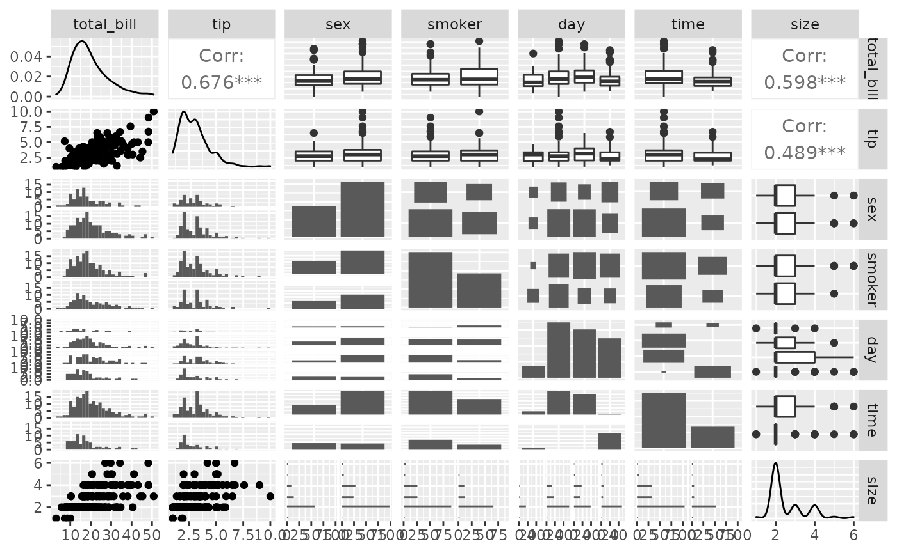
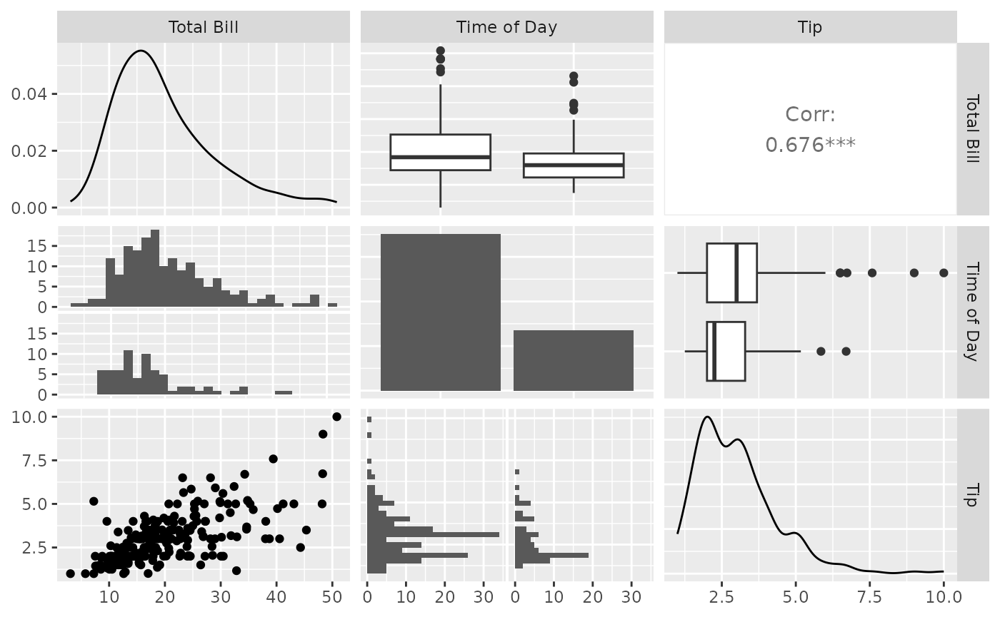
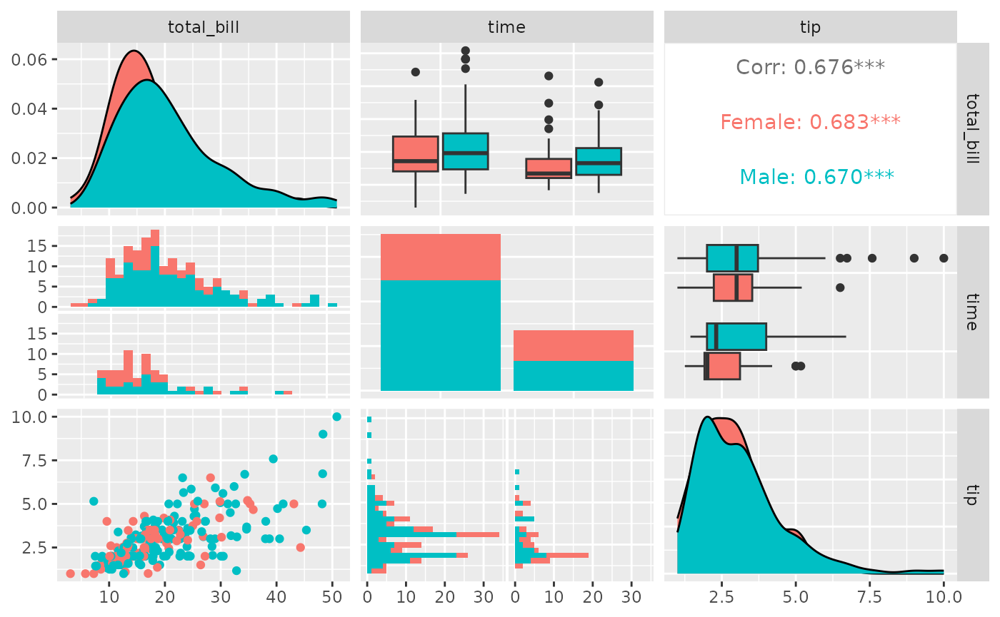
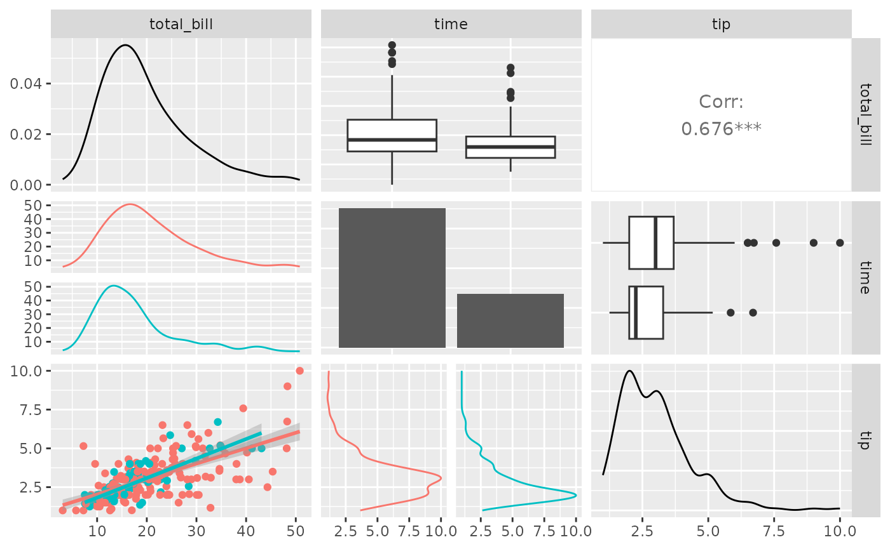
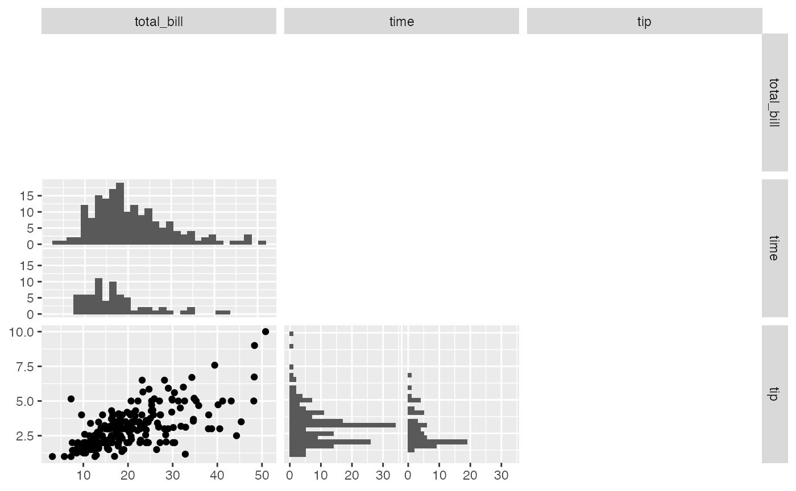
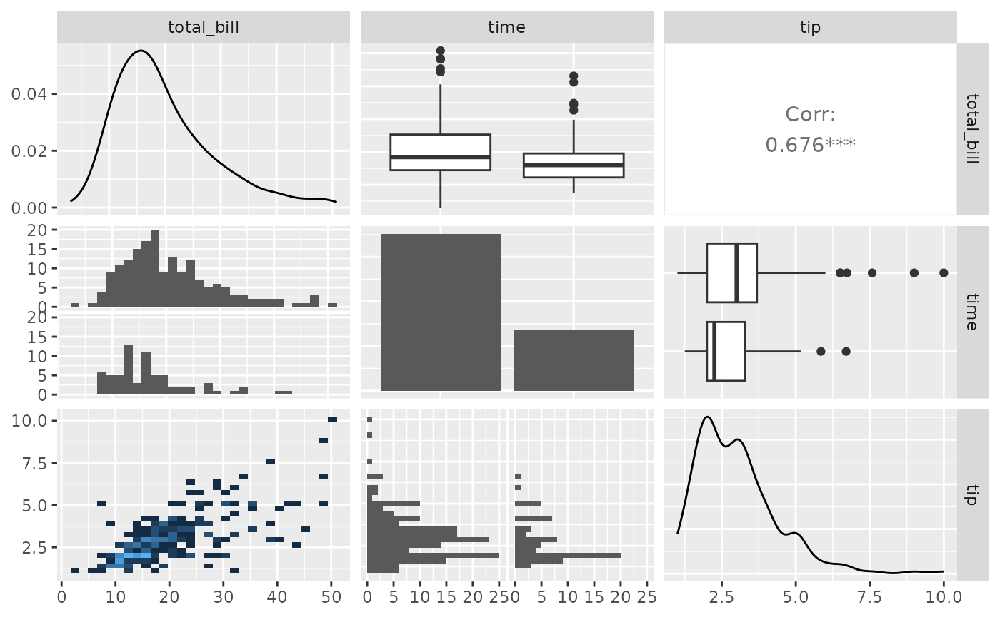
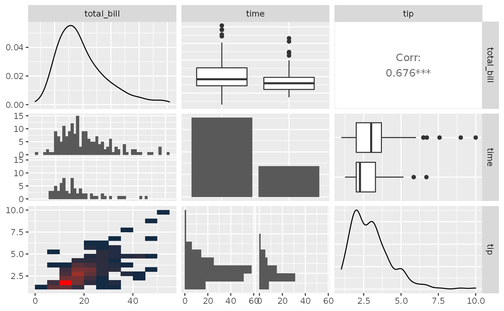
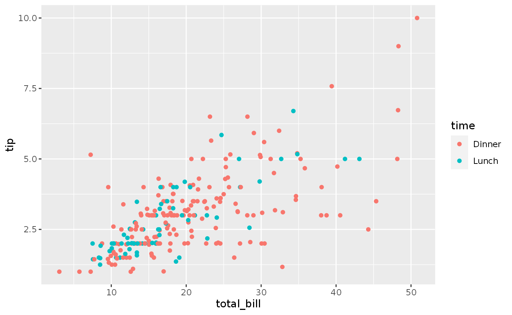
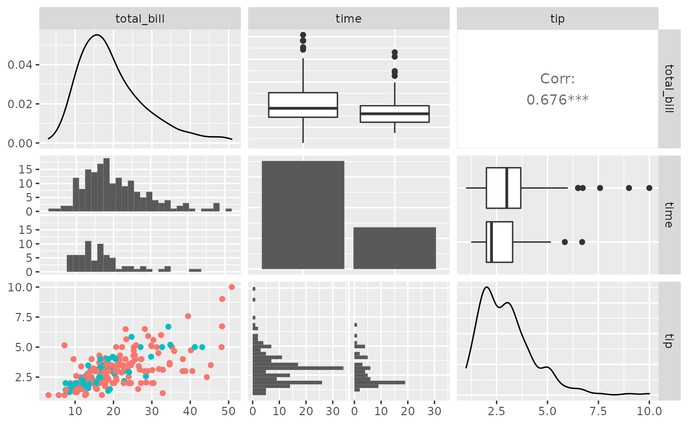
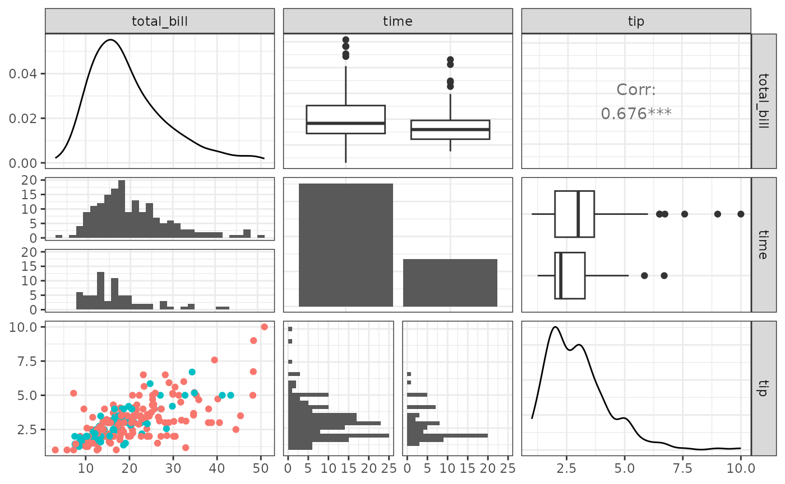

# ggpairs(): Pairwise plot matrix

``` r

library(GGally)
#> Loading required package: ggplot2
```

## `GGally::ggpairs()`

[`ggpairs()`](https://ggobi.github.io/ggally/dev/reference/ggpairs.md)
is a special form of a
[`ggmatrix()`](https://ggobi.github.io/ggally/dev/reference/ggmatrix.md)
that produces a pairwise comparison of multivariate data. By default,
[`ggpairs()`](https://ggobi.github.io/ggally/dev/reference/ggpairs.md)
provides two different comparisons of each pair of columns and displays
either the density or count of the respective variable along the
diagonal. With different parameter settings, the diagonal can be
replaced with the axis values and variable labels.

There are many hidden features within
[`ggpairs()`](https://ggobi.github.io/ggally/dev/reference/ggpairs.md).
Please take a look at the examples below to get the most out of
[`ggpairs()`](https://ggobi.github.io/ggally/dev/reference/ggpairs.md).

### Columns and Mapping

The `columns` displayed default to all columns of the provided `data`.
To subset to only a few columns, use the `columns` parameter.

``` r

data(tips)
pm <- ggpairs(tips)
pm
#> `stat_bin()` using `bins = 30`. Pick better value `binwidth`.
#> `stat_bin()` using `bins = 30`. Pick better value `binwidth`.
#> `stat_bin()` using `bins = 30`. Pick better value `binwidth`.
#> `stat_bin()` using `bins = 30`. Pick better value `binwidth`.
#> `stat_bin()` using `bins = 30`. Pick better value `binwidth`.
#> `stat_bin()` using `bins = 30`. Pick better value `binwidth`.
#> `stat_bin()` using `bins = 30`. Pick better value `binwidth`.
#> `stat_bin()` using `bins = 30`. Pick better value `binwidth`.
#> `stat_bin()` using `bins = 30`. Pick better value `binwidth`.
#> `stat_bin()` using `bins = 30`. Pick better value `binwidth`.
#> `stat_bin()` using `bins = 30`. Pick better value `binwidth`.
#> `stat_bin()` using `bins = 30`. Pick better value `binwidth`.
```



``` r

## too many plots for this example.

## reduce the columns being displayed
## these two lines of code produce the same plot matrix
pm <- ggpairs(tips, columns = c(1, 6, 2))
pm <- ggpairs(tips, columns = c("total_bill", "time", "tip"), columnLabels = c("Total Bill", "Time of Day", "Tip"))
pm
#> `stat_bin()` using `bins = 30`. Pick better value `binwidth`.
#> `stat_bin()` using `bins = 30`. Pick better value `binwidth`.
```



Aesthetics can be applied to every subplot with the `mapping` parameter.

``` r

library(ggplot2)
pm <- ggpairs(tips, mapping = aes(color = sex), columns = c("total_bill", "time", "tip"))
pm
#> `stat_bin()` using `bins = 30`. Pick better value `binwidth`.
#> `stat_bin()` using `bins = 30`. Pick better value `binwidth`.
```



Since the plots are default plots (or are helper functions from GGally),
the aesthetic color is altered to be appropriate. Looking at the example
above, ‘tip’ vs ‘total_bill’ (pm\[3,1\]) needs the `color` aesthetic,
while ‘time’ vs ‘total_bill’ needs the `fill` aesthetic. If custom
functions are supplied, no aesthetic alterations will be done.

### Matrix Sections

There are three major sections of the pairwise matrix: `lower`, `upper`,
and `diag`. The `lower` and `upper` may contain three plot types:
`continuous`, `combo`, and `discrete`. The ‘diag’ only contains either
`continuous` or `discrete`.

- `continuous`: both X and Y are continuous variables
- `combo`: one X and Y variable is discrete while the other is
  continuous
- `discrete`: both X and Y are discrete variables

To make adjustments to each section, a list of information may be
supplied. The list can be comprised of the following elements:

- `continuous`: a character string representing the tail end of a
  `ggally_NAME` function, or a custom function
- `combo`: a character string representing the tail end of a
  `ggally_NAME` function, or a custom function. (not applicable for a
  `diag` list)
- `discrete`: a character string representing the tail end of a
  `ggally_NAME` function, or a custom function
- `mapping`: if mapping is provided, only the section’s mapping will be
  overwritten

The list of current valid `ggally_NAME` functions is visible in
`vig_ggally("ggally_plots")`.

``` r

library(ggplot2)
pm <- ggpairs(
  tips,
  columns = c("total_bill", "time", "tip"),
  lower = list(
    continuous = "smooth",
    combo = "facetdensity",
    mapping = aes(color = time)
  )
)
pm
```



A section list may be set to the character string `"blank"` or `NULL` if
the section should be skipped when printed.

``` r

pm <- ggpairs(
  tips,
  columns = c("total_bill", "time", "tip"),
  upper = "blank",
  diag = NULL
)
pm
#> `stat_bin()` using `bins = 30`. Pick better value `binwidth`.
#> `stat_bin()` using `bins = 30`. Pick better value `binwidth`.
```



### Custom Functions

The `ggally_NAME` functions do not provide all graphical options.
Instead of supplying a character string to a `continuous`, `combo`, or
`discrete` element within `upper`, `lower`, or `diag`, a custom function
may be given.

The custom function should follow the api of

``` r

custom_function <- function(data, mapping, ...) {
  # produce ggplot2 object here
}
```

There is no requirement to what happens within the function, as long as
a ggplot2 object is returned.

``` r

my_bin <- function(data, mapping, ..., low = "#132B43", high = "#56B1F7") {
  ggplot(data = data, mapping = mapping) +
    geom_bin2d(...) +
    scale_fill_gradient(low = low, high = high)
}
pm <- ggpairs(
  tips,
  columns = c("total_bill", "time", "tip"),
  lower = list(
    continuous = my_bin
  )
)
pm
#> `stat_bin()` using `bins = 30`. Pick better value `binwidth`.
#> `stat_bin2d()` using `bins = 30`. Pick better value `binwidth`.
#> `stat_bin()` using `bins = 30`. Pick better value `binwidth`.
```



### Function Wrapping

The examples above use default parameters to each of the subplots. One
of the immediate parameters to be set it `binwidth`. This parameters is
only needed in the lower, combination plots where one variable is
continuous while the other variable is discrete.

To change the default parameter `binwidth` setting, we will
[`wrap()`](https://ggobi.github.io/ggally/dev/reference/wrap.md) the
function.
[`wrap()`](https://ggobi.github.io/ggally/dev/reference/wrap.md) first
parameter should be a character string or a custom function. The
remaining parameters supplied to wrap will be supplied to the function
at run time.

``` r

pm <- ggpairs(
  tips,
  columns = c("total_bill", "time", "tip"),
  lower = list(
    combo = wrap("facethist", binwidth = 1),
    continuous = wrap(my_bin, binwidth = c(5, 0.5), high = "red")
  )
)
pm
```



To get finer control over parameters, please look into custom functions.

### Plot Matrix Subsetting

Please look at the [vignette for ggmatrix](#ggallyggmatrix) on plot
matrix manipulations.

Small
[`ggpairs()`](https://ggobi.github.io/ggally/dev/reference/ggpairs.md)
example:

``` r

pm <- ggpairs(tips, columns = c("total_bill", "time", "tip"))
# retrieve the third row, first column plot
p <- pm[3, 1]
p <- p + aes(color = time)
p
```



``` r

pm[3, 1] <- p
pm
#> `stat_bin()` using `bins = 30`. Pick better value `binwidth`.
#> `stat_bin()` using `bins = 30`. Pick better value `binwidth`.
```



### Themes

Please look at the [vignette for ggmatrix](#ggallyggmatrix) on plot
matrix manipulations.

Small
[`ggpairs()`](https://ggobi.github.io/ggally/dev/reference/ggpairs.md)
example:

``` r

pmBW <- pm + theme_bw()
pmBW
#> `stat_bin()` using `bins = 30`. Pick better value `binwidth`.
#> `stat_bin()` using `bins = 30`. Pick better value `binwidth`.
```



### References

John W Emerson, Walton A Green, Barret Schloerke, Jason Crowley, Dianne
Cook, Heike Hofmann, Hadley Wickham. **[The Generalized Pairs
Plot](http://vita.had.co.nz/papers/gpp.md)**. *Journal of Computational
and Graphical Statistics*, vol. 22, no. 1, pp. 79-91, 2012.
