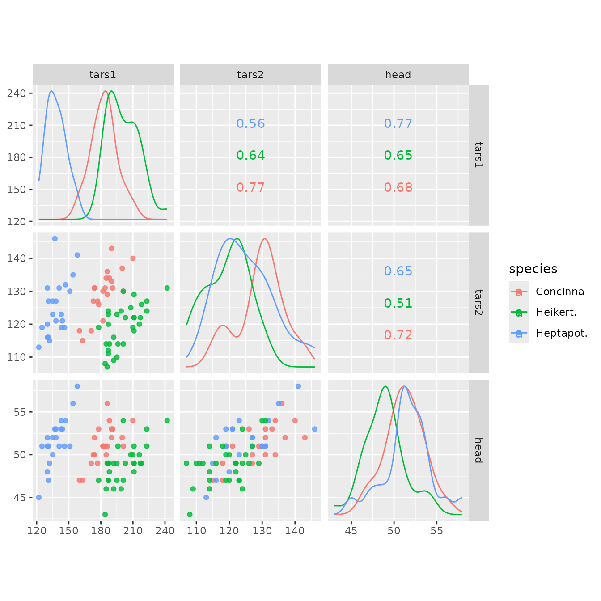

# ggscatmat(): Numeric pairwise plot matrix

``` r

library(GGally)
#> Loading required package: ggplot2
```

## `GGally::ggscatmat()`

The primary function is
[`ggscatmat()`](https://ggobi.github.io/ggally/dev/reference/ggscatmat.md).
It is similar to
[`ggpairs()`](https://ggobi.github.io/ggally/dev/reference/ggpairs.md)
but only works for purely numeric multivariate data. It is faster than
[`ggpairs()`](https://ggobi.github.io/ggally/dev/reference/ggpairs.md),
because less choices need to be made. It creates a matrix with
scatterplots in the lower diagonal, densities on the diagonal and
correlations written in the upper diagonal. Syntax is to enter the
dataset, the columns that you want to plot, a color column, and an alpha
level.

``` r

data(flea)
ggscatmat(flea, columns = 2:4, color = "species", alpha = 0.8)
```



In this plot, you can see that the three different species vary a little
from each other in these three variables. Heptapot (blue) has smaller
values on the variable `tars1` than the other two. The correlation
between the three variables is similar for all species.

### References

John W Emerson, Walton A Green, Barret Schloerke, Jason Crowley, Dianne
Cook, Heike Hofmann, Hadley Wickham. **[The Generalized Pairs
Plot](http://vita.had.co.nz/papers/gpp.md)**. *Journal of Computational
and Graphical Statistics*, vol. 22, no. 1, pp. 79-91, 2012.
