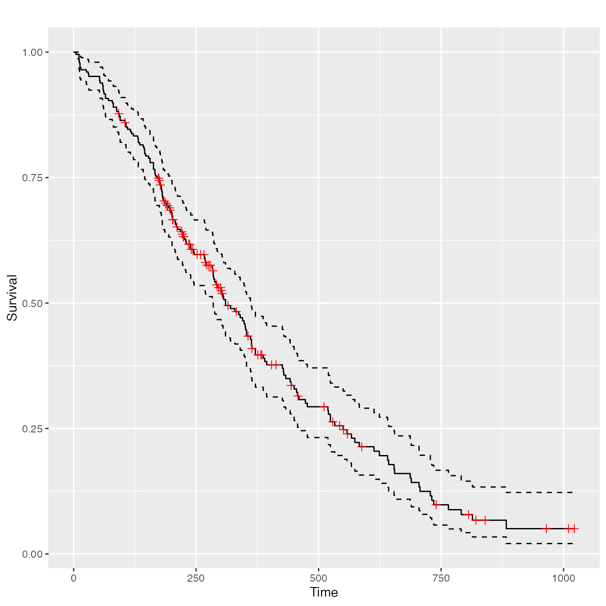
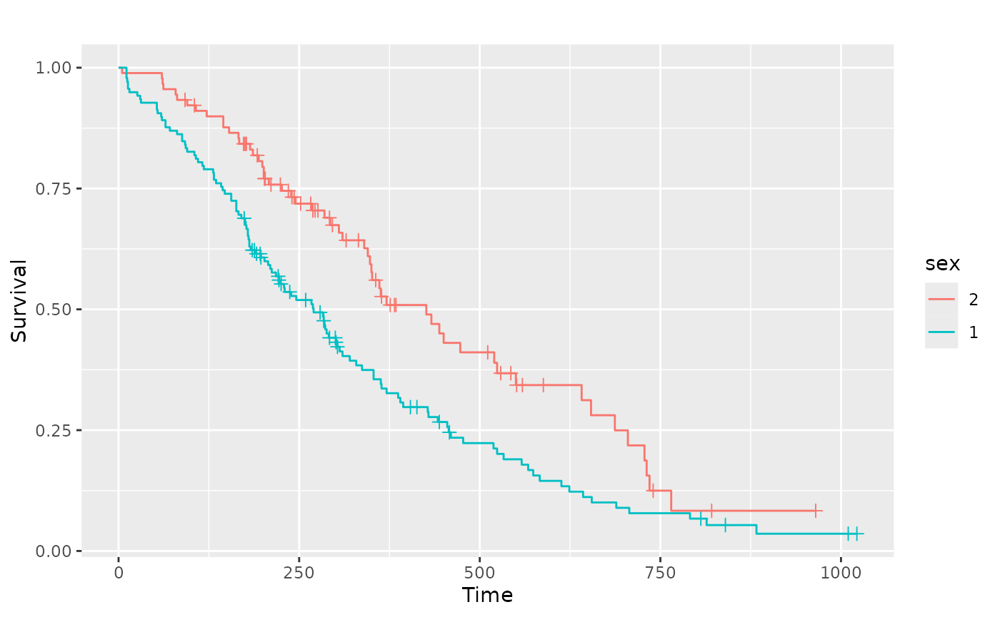
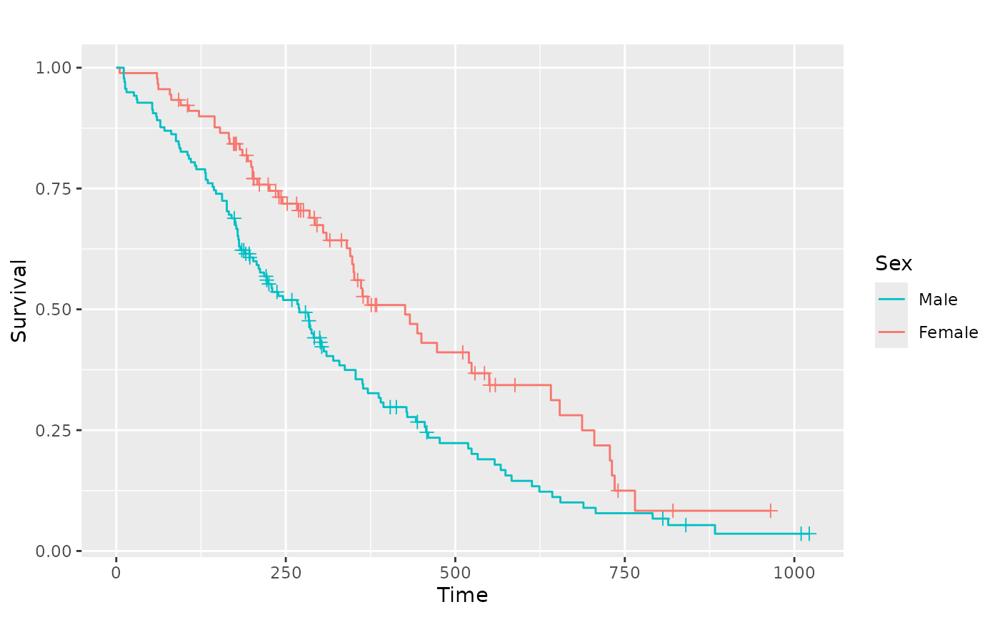
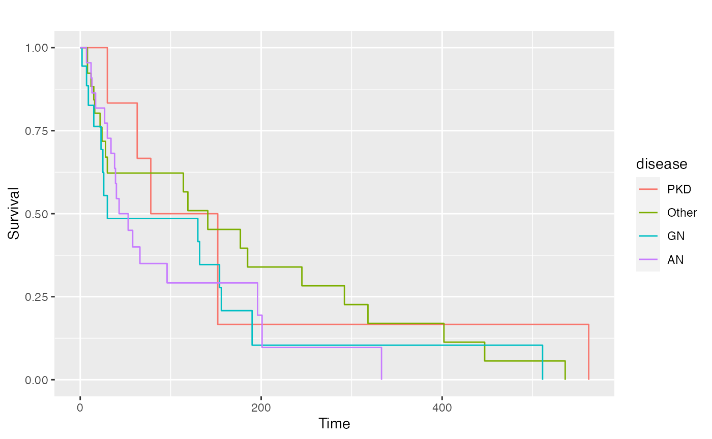
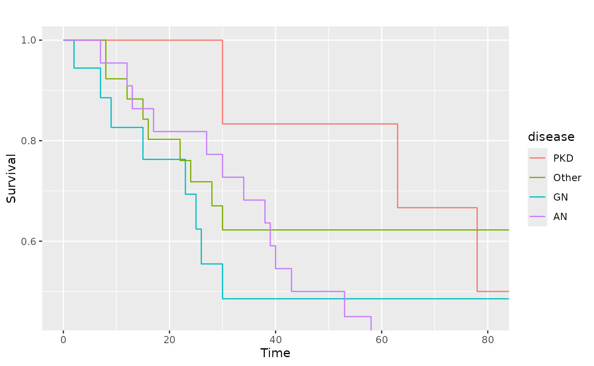
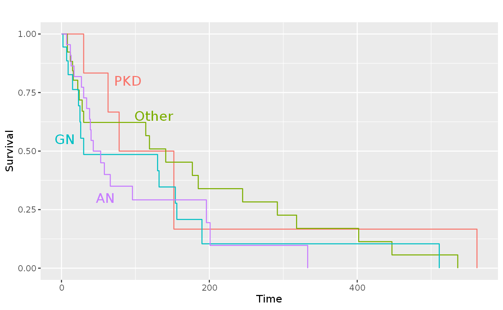

# ggsurv(): Survival curves

``` r

library(GGally)
#> Loading required package: ggplot2
```

## `GGally::ggsurv()`

This function produces Kaplan-Meier plots using `ggplot2`. As a first
argument,
[`ggsurv()`](https://ggobi.github.io/ggally/dev/reference/ggsurv.md)
needs a
[`survival::survfit()`](https://rdrr.io/pkg/survival/man/survfit.html)
object. Default settings differ for single stratum and multiple strata
objects.

### Single Stratum

``` r

require(ggplot2)
require(survival)
#> Loading required package: survival
require(scales)
#> Loading required package: scales

data(lung, package = "survival")
#> Warning in data(lung, package = "survival"): data set 'lung' not found
sf.lung <- survival::survfit(Surv(time, status) ~ 1, data = lung)
ggsurv(sf.lung)
```



### Multiple Stratum

The legend color positions matches the survival order or each stratum,
where the stratums that end at a lower value or time have a position
that is lower in the legend.

``` r

sf.sex <- survival::survfit(Surv(time, status) ~ sex, data = lung)
pl.sex <- ggsurv(sf.sex)
pl.sex
```



### Alterations

Since a ggplot2 object is returned, plot objects may be altered after
the original creation.

#### Adjusting the legend

``` r

pl.sex +
  ggplot2::guides(linetype = "none") +
  ggplot2::scale_colour_discrete(
    name   = "Sex",
    breaks = c(1, 2),
    labels = c("Male", "Female")
  )
#> Scale for colour is already present.
#> Adding another scale for colour, which will replace the existing
#> scale.
```



#### Adjust the limits

``` r

data(kidney, package = "survival")
#> Warning in data(kidney, package = "survival"): data set 'kidney' not
#> found
sf.kid <- survival::survfit(Surv(time, status) ~ disease, data = kidney)
pl.kid <- ggsurv(sf.kid, plot.cens = FALSE)
pl.kid
```



``` r


# Zoom in to first 80 days
pl.kid + ggplot2::coord_cartesian(xlim = c(0, 80), ylim = c(0.45, 1))
```



#### Add text and remove the legend

``` r

pl.kid +
  ggplot2::annotate(
    "text",
    label = c("PKD", "Other", "GN", "AN"),
    x = c(90, 125, 5, 60),
    y = c(0.8, 0.65, 0.55, 0.30),
    size = 5,
    colour = scales::pal_hue(
      h         = c(0, 360) + 15,
      c         = 100,
      l         = 65,
      h.start   = 0,
      direction = 1
    )(4)
  ) +
  ggplot2::guides(color = "none", linetype = "none")
```


