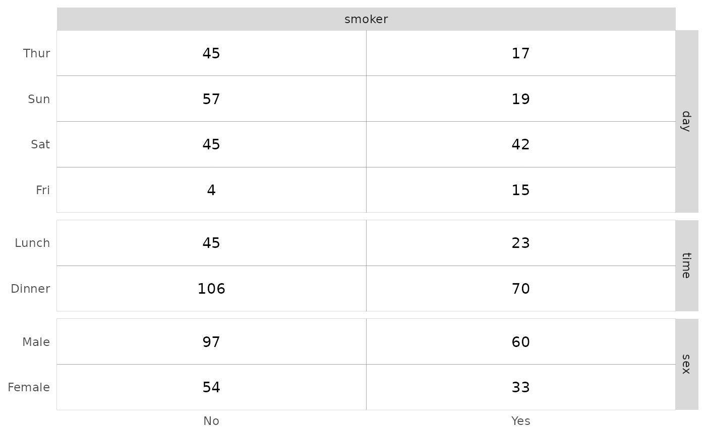
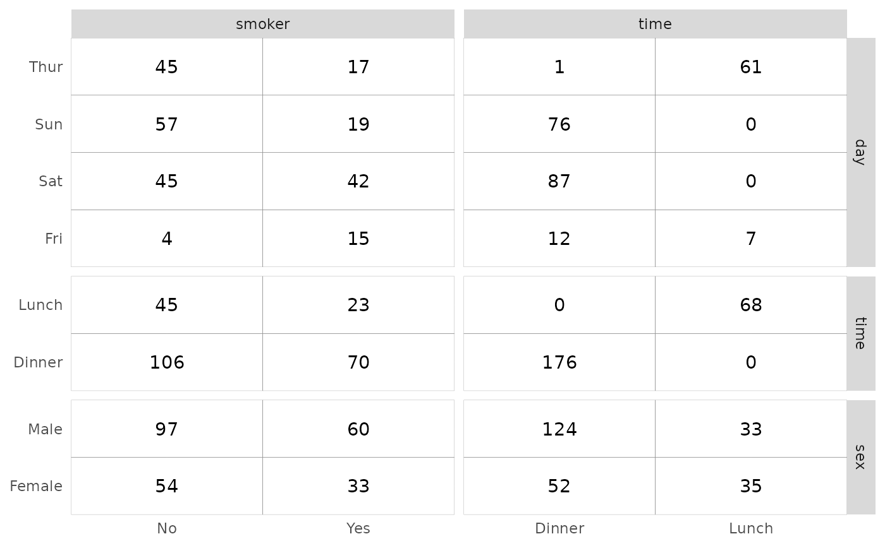
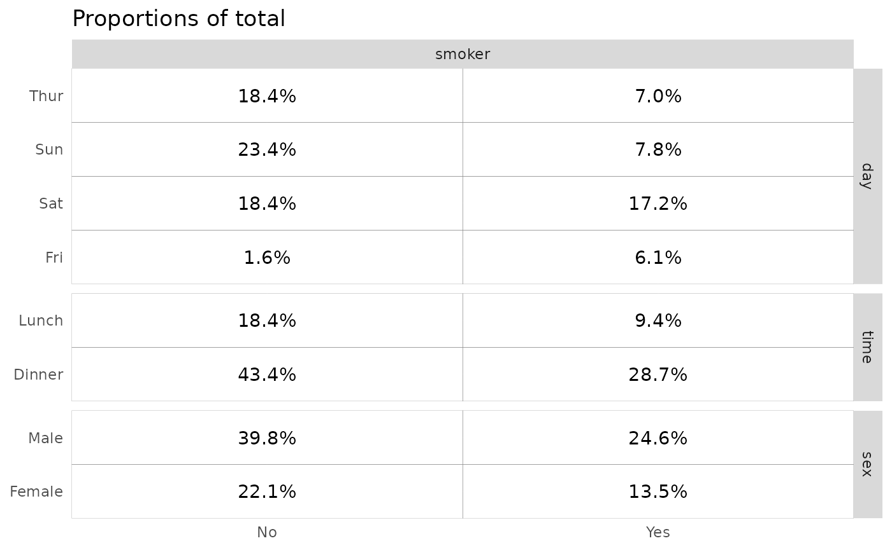
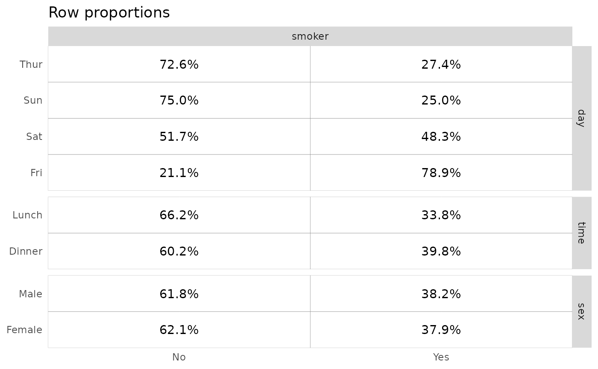
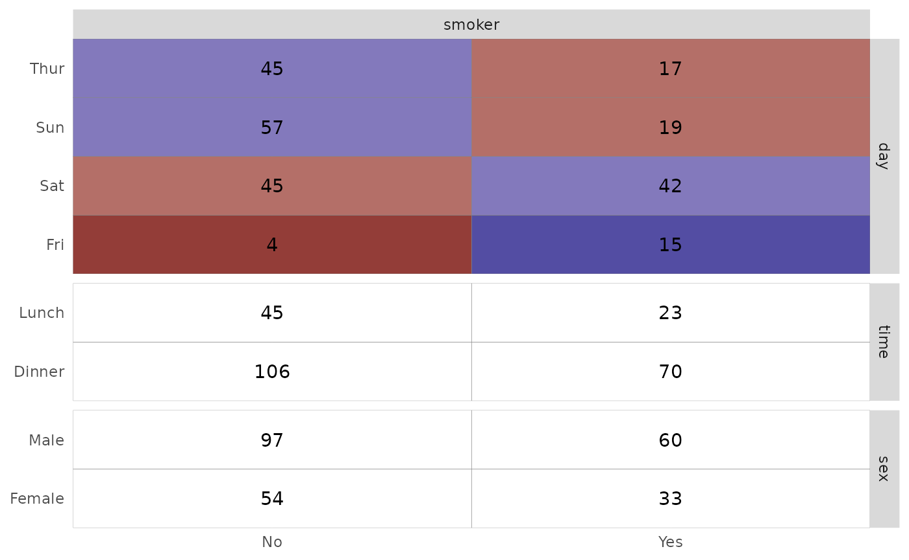
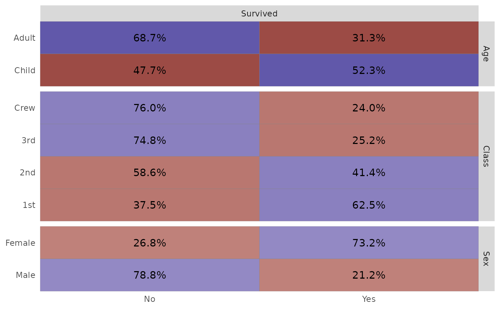
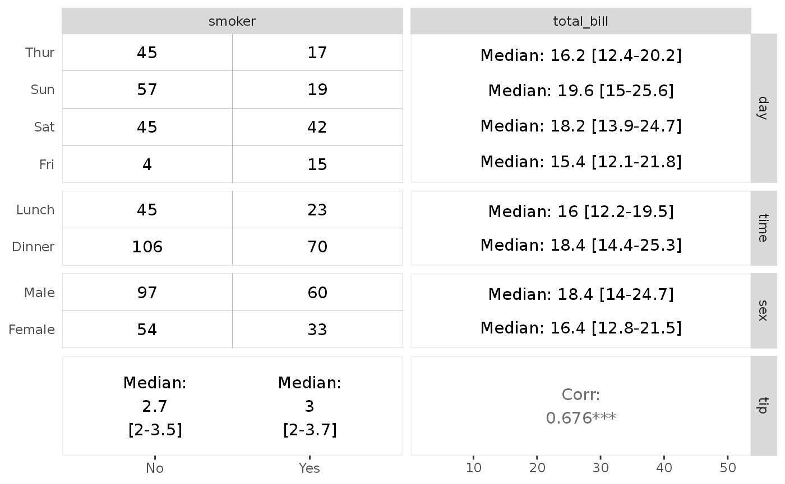

# ggtable(): Cross-tabulated tables

``` r

library(GGally)
#> Loading required package: ggplot2
```

## `GGally::ggtable()`

The purpose of this function is to quickly plot cross-tabulated tables
of discrete variables.

### Basic example

To display tables with the number of observations, simply indicate
variables to present in columns and in rows.

``` r

data(tips)
ggtable(tips, "smoker", c("day", "time", "sex"))
```



``` r

ggtable(tips, c("smoker", "time"), c("day", "time", "sex"))
```



### Proportions

The `cells` argument allows you to control what to display. For
proportions of the total, row proportions or columns proportions, simply
use `"prop"`, `"row.prop"` or `"col.prop"`.

``` r

ggtable(tips, "smoker", c("day", "time", "sex"), cells = "prop") + ggtitle("Proportions of total")
```



``` r

ggtable(tips, "smoker", c("day", "time", "sex"), cells = "row.prop") + ggtitle("Row proportions")
```



``` r

ggtable(tips, "smoker", c("day", "time", "sex"), cells = "prop") + ggtitle("Column proportions")
```


### Filling cells with residuals

Chi-square standardized residuals indicates which cells are over- or
underrepresented compared to what would be expected under the
independence hypothesis. If the standardized residual is less than -2,
the cell’s observed frequency is less than the expected frequency.
Greater than 2 and the observed frequency is greater than the expected
frequency. Values lower than -3 or higher than 3 indicates a strong
effect.

To fill cells with standardized residuals, simply indicate
`fill = "std.resid"`.

``` r

ggtable(tips, "smoker", c("day", "time", "sex"), fill = "std.resid")
```



### Using weights

You can easily indicate weights to take into account with the **weight**
aesthetic.

``` r

d <- as.data.frame(Titanic)
ggtable(
  d,
  "Survived",
  c("Age", "Class", "Sex"),
  mapping = aes(weight = Freq),
  cells = "row.prop",
  fill = "std.resid"
)
```



### Missing with continuous variables

Although
[`ggtable()`](https://ggobi.github.io/ggally/dev/reference/ggtable.md)
is mainly intended to be used with discrete variables, you can also
indicate continuous variables. In such case, some summary statistics are
displayed.

``` r

ggtable(tips, c("smoker", "total_bill"), c("day", "time", "sex", "tip"))
```



If you need more customization of the output, please refer to
[`ggduo()`](https://ggobi.github.io/ggally/dev/reference/ggduo.md).
