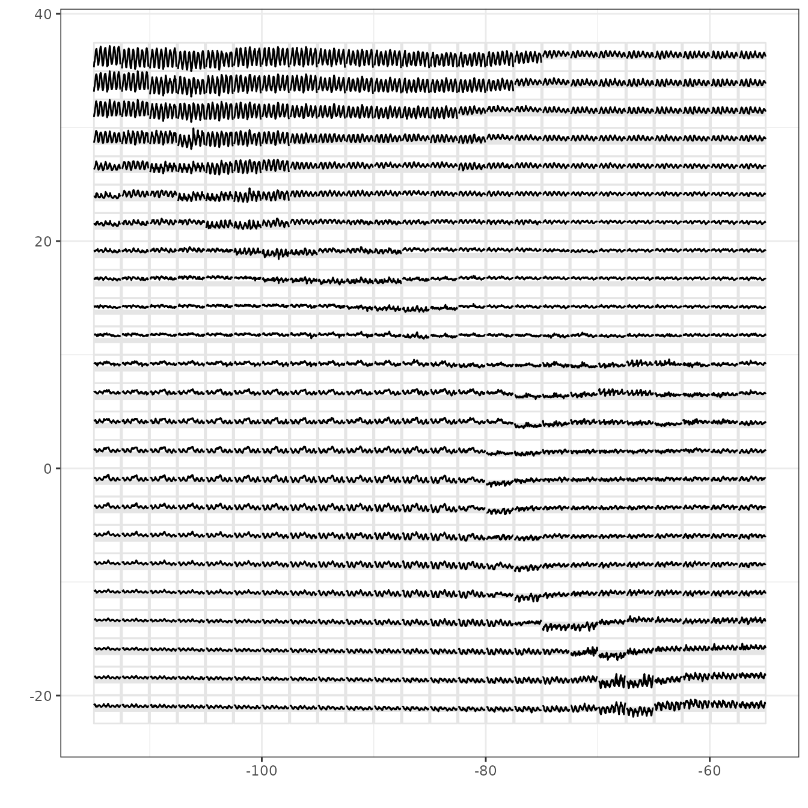

# glyphs(): Glyph plot

``` r

library(GGally)
#> Loading required package: ggplot2
```

## `GGally::glyphs()`

This function rearranges data to be able to construct a glyph plot

``` r

library(ggplot2)
data(nasa)
temp.gly <- glyphs(nasa, "long", "day", "lat", "surftemp", height = 2.5)
#> Using width 2.38
ggplot(temp.gly, ggplot2::aes(gx, gy, group = gid)) +
  add_ref_lines(temp.gly, color = "grey90") +
  add_ref_boxes(temp.gly, color = "grey90") +
  geom_path() +
  theme_bw() +
  labs(x = "", y = "")
```



This shows a glyphplot of monthly surface temperature for 6 years over
Central America. You can see differences from one location to another,
that in large areas temperature doesn’t change much. There are large
seasonal trends in the top left over land.

Rescaling in different ways puts emphasis on different components, see
the examples in the referenced paper. And with ggplot2 you can make a
map of the geographic area underlying the glyphs.

### References

Wickham, H., Hofmann, H., Wickham, C. and Cook, D. (2012) Glyph-maps for
Visually Exploring Temporal Patterns in Climate Data and Models,
**Environmetrics**, *23*(5):151-182.
